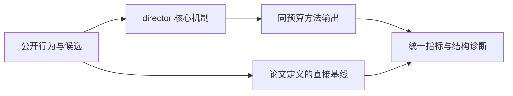
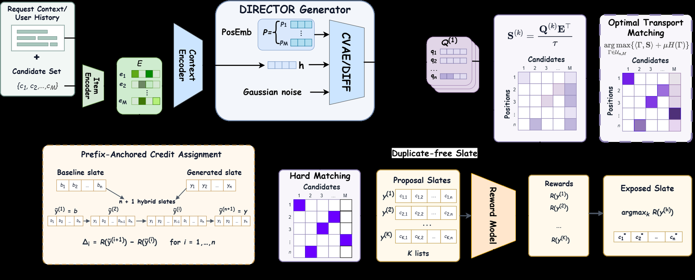

# DIRECTOR：运输优化的动态索引并行推荐

> **Fidelity: 核心机制复现**。本地代码执行论文最有辨识度、可由公开数据验证的机制；生产模型、私有日志与服务基础设施明确列为边界，不用普通基线冒充完整工业系统。

## 论文信息

| 项目 | 内容 |
| --- | --- |
| 论文链接 | [arXiv 2607.26418](https://arxiv.org/abs/2607.26418) |
| 公司/机构 | 中国科学技术大学（第一作者 Yuanhao Pu） |
| 首次公开日期 | 2026-07-29（arXiv v1） |
| 原文开源代码 | 否：论文未提供官方/作者代码（核查日期：2026-09-01） |
| Adapter | `director` |
| 本地复现代码 | [`src/auto_research/reproductions/director/`](https://github.com/daiwk/auto-research/tree/main/src/auto_research/reproductions/director/) |

## 原始论文总结

### 背景与主要改动

每个展示位置生成动态索引分布，以 Sinkhorn 最优运输联合约束所有位置；最终用全局匹配而非独立 argmax 解码，减少冲突并一次并行产生整张 slate。



<!-- paper-figure:start -->
### 原论文关键图

[](https://arxiv.org/html/2607.26418v1/images/direc_colore.png)

> **原论文 Figure 1（关键图）**：展示原论文提出的核心架构、主要模块及其连接关系。图片来自[原论文](https://arxiv.org/abs/2607.26418)，版权归原作者所有；点击图片可查看来源。
<!-- paper-figure:end -->

### 核心公式

$$
T^*=\arg\max_{T\in\mathcal U(a,b)}\langle T,S\rangle+\varepsilon H(T),\qquad \pi^*=\arg\max_\pi\sum_j S_{j,\pi(j)}.
$$

### 论文离线与线上效果

- 两个互斥 10% 桶运行 7 天：valid view +0.519%（95% CI [0.45%, 0.59%]）、comment +0.695%、like +0.330%，CPU -66.7%。
- 上述数字只复述论文线上证据，不写入本地公开数据的效果结论。

## 本地复现

> **本地对照口径**：基线为各位置独立动态索引，实验组加入 Sinkhorn transport 与硬全局匹配；seed 42 的 NDCG@10 为 `0.05334`，基线为 `0.03857`。相对生产 valid view 的外推不适用。

三随机种子完整结果、均值、标准差与 95% CI：

- [`metrics/public-seeds42-44.json`](metrics/public-seeds42-44.json)

```bash
auto-research reproduce --paper director --dataset-dir data --seed 42
```

## 复现边界

本地使用公开 MovieLens 特征或由其构造的可审计代理任务，不能复现论文公司的私有用户日志、线上流量分配、生产模型规模和 serving 栈。因此本页只把本地结果解释为机制级验证；不将其外推为论文线上 lift，也不声称与原文绝对指标可直接比较。
