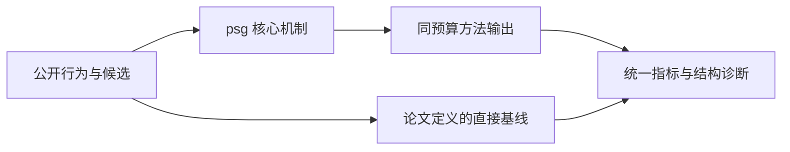
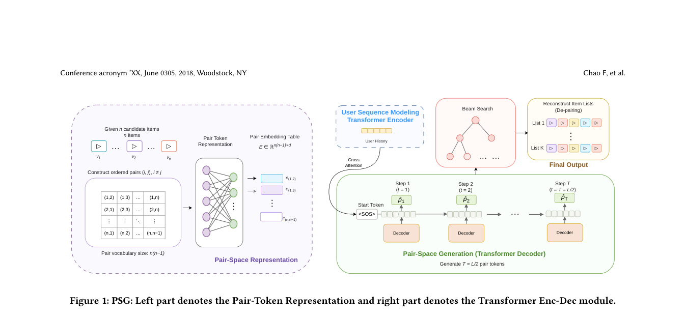

# PSG：用 pair-space 缩短生成式重排序列

> **Fidelity: 核心机制复现**。本地代码执行论文最有辨识度、可由公开数据验证的机制；生产模型、私有日志与服务基础设施明确列为边界，不用普通基线冒充完整工业系统。

## 论文信息

| 项目 | 内容 |
| --- | --- |
| 论文链接 | [arXiv 2607.26427](https://arxiv.org/abs/2607.26427) |
| 公司/机构 | 快手科技（第一作者 Chao Feng） |
| 首次公开日期 | 2026-07-29（arXiv v1） |
| 原文开源代码 | 否：论文未提供官方/作者代码（核查日期：2026-09-01） |
| Adapter | `psg` |
| 本地复现代码 | [`src/auto_research/reproductions/psg/`](https://github.com/daiwk/auto-research/tree/main/src/auto_research/reproductions/psg/) |

## 原始论文总结

### 背景与主要改动

把相邻两个 item 编成一个请求内 pair token，在 pair 空间生成半长度序列，再无损展开为 item slate；pair scorer 显式保留顺序，重复约束保证展开结果可用。



<!-- paper-figure:start -->
### 原论文关键图

[](https://arxiv.org/pdf/2607.26427#page=4)

> **原论文 Figure 1（关键图）**：展示原论文方法的总体设计和关键组成。图片来自[原论文](https://arxiv.org/abs/2607.26427)，版权归原作者所有；点击图片可查看来源。
<!-- paper-figure:end -->

### 核心公式

$$
p_t=(i_{2t-1},i_{2t}),\qquad P(p_t\mid p_{<t},u)\propto\exp s_u(i_{2t-1},i_{2t}).
$$

### 论文离线与线上效果

- 两个互斥 10% 流量桶运行 7 天，用户停留时长 +0.178%；工业配置报告 1.83× 解码加速。
- 上述数字只复述论文线上证据，不写入本地公开数据的效果结论。

## 本地复现

> **本地对照口径**：基线为六步 item-space 生成，实验组为三步 pair-space 生成与展开；seed 42 的 NDCG@10 为 `0.04826`，基线为 `0.05401`，负结果保留。相对生产加速的外推不适用。

三随机种子完整结果、均值、标准差与 95% CI：

- [`metrics/public-seeds42-44.json`](metrics/public-seeds42-44.json)

```bash
auto-research reproduce --paper psg --dataset-dir data --seed 42
```

## 复现边界

本地使用公开 MovieLens 特征或由其构造的可审计代理任务，不能复现论文公司的私有用户日志、线上流量分配、生产模型规模和 serving 栈。因此本页只把本地结果解释为机制级验证；不将其外推为论文线上 lift，也不声称与原文绝对指标可直接比较。
