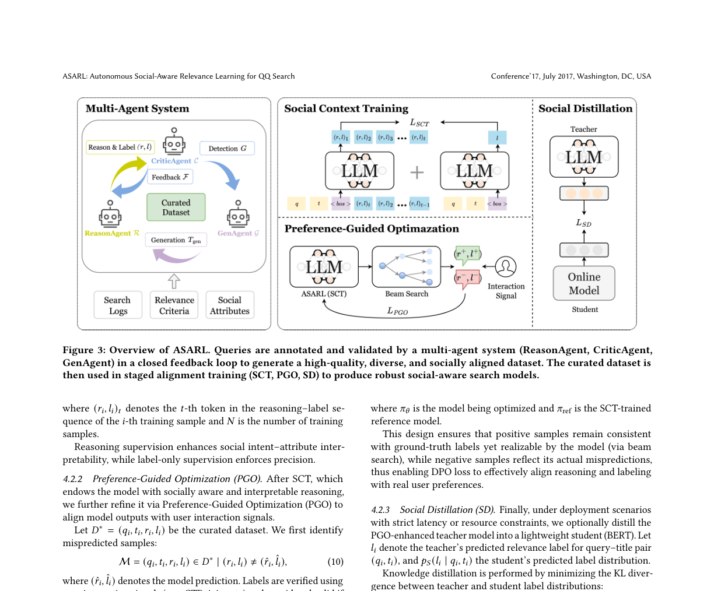

# ASARL

> **Fidelity: 核心机制复现**。实际执行多 Agent 数据整理、SCT、偏好优化与 social distillation；闭源 LLM 和 QQ 私有日志未复刻。

## 论文信息

| 项目 | 内容 |
| --- | --- |
| 论文链接 | [arXiv 2607.26593](https://arxiv.org/abs/2607.26593) |
| 公司/机构 | Tencent PCG |
| 首次公开日期 | 2026-07-29（arXiv v1） |
| 原文开源代码 | 否：论文未提供官方/作者代码（核查日期：2026-07-28） |
| Adapter | `asarl` |
| 本地复现代码 | [`src/auto_research/reproductions/asarl/`](https://github.com/daiwk/auto-research/tree/main/src/auto_research/reproductions/asarl/) |

## 原始论文总结

### 背景与主要改动

QQ 群与频道搜索面对口语化标题、长尾数据和行为漂移。ASARL 用 ReasonAgent 产出
intent–attribute reasoning 与三级相关性标签，CriticAgent 反复校验并检测分布缺口，
GenAgent 为长尾区域补样本；随后执行 Social Context Training、基于交互信号的
Preference-Guided Optimization，最后蒸馏到可在线服务的小模型。


<!-- paper-figure:start -->
### 原论文关键图

[](https://arxiv.org/abs/2607.26593)

图片来自[原论文](https://arxiv.org/abs/2607.26593)，版权归原作者所有；点击图片可查看来源。
<!-- paper-figure:end -->

### 核心公式

PGO 对经行为信号验证的正负 reasoning-label 序列使用 DPO：

$$
\mathcal L_{\mathrm{PGO}}=-\mathbb E\log\sigma\left[
\beta\log\frac{\pi_\theta(y^+|q,t)}{\pi_{\rm ref}(y^+|q,t)}
-\beta\log\frac{\pi_\theta(y^-|q,t)}{\pi_{\rm ref}(y^-|q,t)}
\right],
$$

线上 student 再最小化 teacher 与 student 标签分布的 KL。

### 论文离线与线上效果

- 蒸馏 student 相对原 online RoBERTa：Macro-F1 65.01→72.05，NDCG@4
  75.70→76.41，accuracy 67.45→73.92。
- QQ A/B 平台各分配 20% treatment/control，至少 7 天；频道搜索 CTR +2.69%、
  join rate +2.59%、GSB +11.66%，群搜索分别 +1.36%、+1.06%、+16.66%；
  部署覆盖 1200 万 DAU。

## 本地复现

> **本地对照口径**：基线与实验组使用同一 MovieLens relevance proxy、student 参数量、训练划分和 seed；实验组增加 Reason/Critic/Gen、PGO 与蒸馏，相对 NDCG@10 为 -72.72%。

MovieLens-1M 上以 genre 交集代理社交属性，执行 Reason/Critic/Gen 数据整理、SCT
三级分类、偏好 margin 和 teacher-to-student distillation；对照组是相同参数量、只用
原始监督的 online student。

```bash
auto-research reproduce --paper asarl --dataset-dir data --seed 42
```

固定 seed：对照 NDCG@10 0.03598，ASARL proxy 0.00982（-72.72%）；实验组分类
loss 1.1719→0.3295，但该代理目标没有迁移到 next-item 排序。完整指标见
[`metrics/movielens-1m-seed42.json`](metrics/movielens-1m-seed42.json)；跨领域摘要见
[`latest-cross-domain-20260730-seed42.json`](../../experiments/latest-cross-domain-20260730-seed42.json)。

## 复现边界

没有 QQ 私有 query-title 日志、生产 LLM 标注 Agent 或线上 RoBERTa。这里验证的是闭环
数据整理、偏好阶段和蒸馏路径；MovieLens genre 代理造成的负迁移被原样保留。
