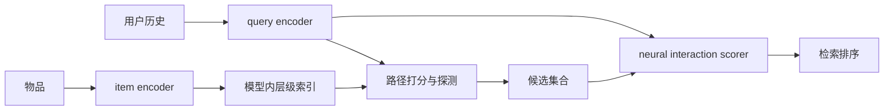
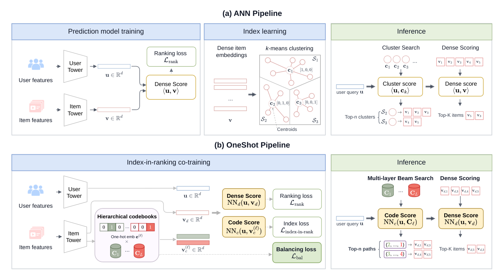

# OneShot：把可学习索引放进排序模型

> **Fidelity: 核心机制复现**。本地执行 ranking-shaped 分层索引、路径探测和非点积 neural scoring；确定性 assignment 代理生产训练中的 STE 与全局平衡优化。

## 论文信息

| 项目 | 内容 |
| --- | --- |
| 论文链接 | [arXiv 2607.27475](https://arxiv.org/abs/2607.27475) |
| 公司/机构 | Meta / Instagram |
| 首次公开日期 | 2026-07-29（arXiv v1） |
| 原文开源代码 | 否：截至 2026-08-24 未发现原作者公开代码 |
| Adapter | `oneshot-index` |
| 本地复现代码 | [`src/auto_research/reproductions/oneshot_index/`](https://github.com/daiwk/auto-research/tree/main/src/auto_research/reproductions/oneshot_index/) |

## 原始论文总结

### 背景与主要改动

传统 ANN 索引按 embedding 几何邻近性组织物品，而排序目标直接优化用户行为，两者不一致。OneShot 在模型内共同学习层级索引和排序：前向使用离散路径，反向用 straight-through estimator；全局路径平衡避免热门桶拥塞；候选进入路径后再使用比点积更强的 neural scoring。



<!-- paper-figure:start -->
### 原论文关键图

[](https://arxiv.org/html/2607.27475v2/system_comparison_new.png)

> **原论文 Figure 1（关键图）**：展示原论文的整体流程、关键阶段及其数据流向。图片来自[原论文](https://arxiv.org/abs/2607.27475)，版权归原作者所有；点击图片可查看来源。
<!-- paper-figure:end -->

### 核心公式

离散路径用 STE 连接 ranking loss：

$$
z_l=\operatorname{onehot}(\arg\max_j a_{l,j}),\qquad
\frac{\partial z_l}{\partial a_l}\approx\frac{\partial\operatorname{softmax}(a_l)}{\partial a_l}.
$$

训练目标联合排序、索引和全局平衡：

$$
\mathcal L=\mathcal L_{rank}+\lambda_{idx}\mathcal L_{index}+\lambda_{bal}\mathcal L_{global\ balance}.
$$

### 论文离线与线上效果

OneShot 在 operational ranking volume 上 Recall `+20%`，等召回效率提高 `10×`。该模型已部署到 Instagram 全球流量；线上 A/B 的 daily sessions `+0.035%`、watch time `+0.136%`、post impressions `+0.278%`、source rate `+61.58%`。

## 本地复现

> **本地对照口径**：基线为同数据、同全库评测的 two-tower 点积检索；实验组加入 ranking-shaped 分层索引和 neural scoring，NDCG@10 相对 `-7.70%`。

MovieLens-100K 单 seed 中，two-tower 基线 Hit@10/NDCG@10 为 `0.0409/0.0144`，OneShot 为 `0.0364/0.0132`，相对 `-11.11%/-7.70%`。小目录上的索引约束损失了候选覆盖，说明论文收益依赖十亿规模下的索引-排序失配和完整平衡训练。

```bash
auto-research reproduce --paper oneshot-index --dataset-dir data --seed 42
```

稳定指标见 [`metrics/movielens-100k-seed42.json`](metrics/movielens-100k-seed42.json)。

## 复现边界

未复刻 Instagram 私有数据、十亿物品多机索引、STE 训练 kernel、SCO 全局平衡与线上检索服务；本地结果不等同论文复现指标。
