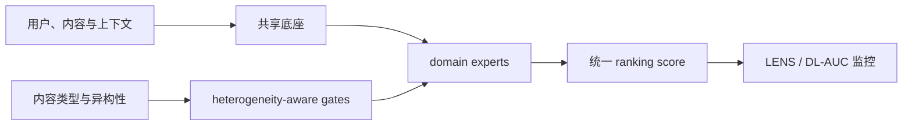
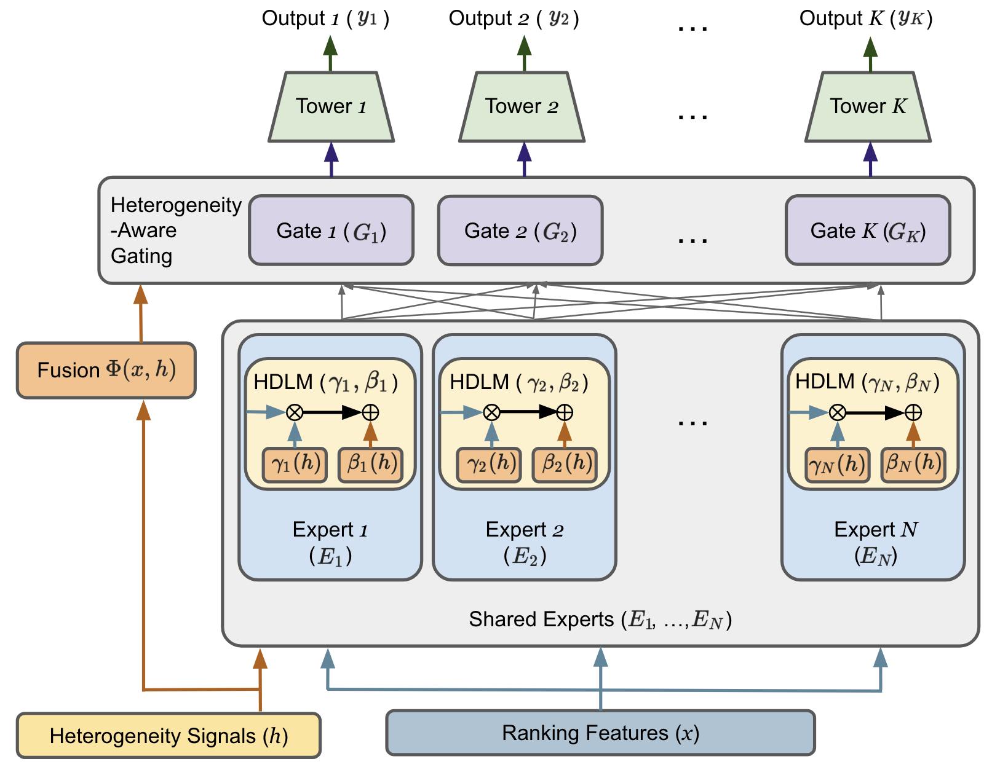

# HA-MoE：工业异构内容统一排序

> **Fidelity: 核心机制复现**。本地执行异构性度量、专长 expert 与多门控融合，不把 MovieLens 代理实验写成 Google Discover 生产复刻。

## 论文信息

| 项目 | 内容 |
| --- | --- |
| 论文链接 | [arXiv 2607.27577](https://arxiv.org/abs/2607.27577) |
| 公司/机构 | Google / Discover |
| 首次公开日期 | 2026-07-30（arXiv v1） |
| 原文开源代码 | 否：论文未提供官方/作者代码（核查日期：2026-08-09） |
| Adapter | `ha-moe` |
| 本地复现代码 | [`src/auto_research/reproductions/ha_moe/`](https://github.com/daiwk/auto-research/tree/main/src/auto_research/reproductions/ha_moe/) |

## 原始论文总结

### 背景与主要改动

Discover 要在同一 feed 中比较新闻、视频、体育等开放网页内容，单一共享塔会让高频内容支配梯度。HA-MoE 用内容异构性特征控制 multi-gate MoE，把通用信号与领域专长分开；LENS 则追踪 expert 使用率和分领域 DL-AUC，避免总体指标掩盖局部退化。



<!-- paper-figure:start -->
### 原论文关键图

[](https://arxiv.org/html/2607.27577v1#S3.F2)

> 原论文 Figure 2：HA-MoE 与异构内容统一排序框架。图片来自[原论文](https://arxiv.org/abs/2607.27577)，版权归原作者所有。
<!-- paper-figure:end -->

### 核心公式

对样本 $x$，门控网络依据异构上下文 $h$ 给 expert 分配权重：

$$
y(x,h)=\sum_{e=1}^{E}\operatorname{softmax}(g(h))_e f_e(x).
$$

本地以 session 领域熵构造 $h$，实际执行 domain、transition、content、freshness 四个 expert。

### 论文离线与线上效果

- 7 天、1% live traffic A/B：DAU `+0.22%±0.11%`，Viewed Impressions `+0.48%±0.34%`。
- Scroll Depth `+0.34%±0.25%`，Diverse Feed Rate `+0.36%±0.03%`，Diverse Engagement Rate `+0.54%±0.07%`。

## 本地复现

> **本地对照口径**：基线为同切分的 homogeneous transition-content ranker，实验组加入 HA-MoE；NDCG@10 相对 `-1.77%`。

MovieLens 100K 固定 220 users / 360 items，全目录排序；同一 transition-content 基线和 validation-only 融合选择。HA-MoE 的 Hit@10 持平，NDCG@10 `-1.77%`，head share `-7.65%`。小数据上多样性改善但主指标未提升，按负结果保留。

指标见 [`metrics/movielens-100k-seed42.json`](metrics/movielens-100k-seed42.json)。

```bash
auto-research reproduce --paper ha-moe --dataset-dir data --seed 42
```

## 复现边界

MovieLens genre 代理开放网页内容类型；未复刻 Discover 私有样本、LENS 生产观测系统和 DL-AUC 服务。
