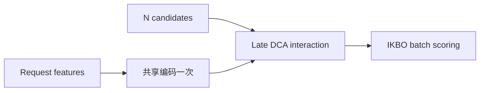
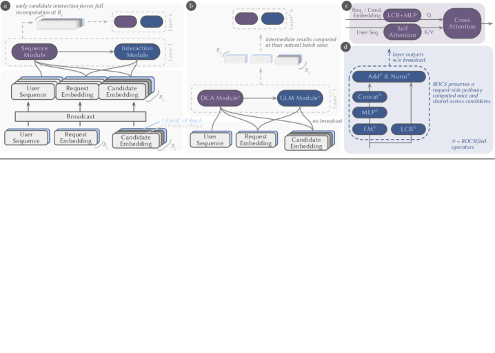

# ROCS：按请求共享推荐计算

> **Fidelity: 核心机制复现**。实现一次 request encoding、延迟 candidate interaction 和批量候选评分。

## 论文信息

| 项目 | 内容 |
| --- | --- |
| 论文链接 | [arXiv 2607.27744](https://arxiv.org/abs/2607.27744) |
| 公司/机构 | Meta AI |
| 首次公开日期 | 2026-07-30（arXiv v1） |
| 原文开源代码 | 是：[官方/作者代码](https://github.com/pytorch/FBGEMM/tree/main/fbgemm_gpu/experimental/ikbo) |
| Adapter | `rocs` |
| 本地复现代码 | [`src/auto_research/reproductions/rocs/`](https://github.com/daiwk/auto-research/tree/main/src/auto_research/reproductions/rocs/) |

## 原始论文总结

### 背景与主要改动

一次推荐请求会评分大量候选，而用户侧特征完全相同。ROCS 通过 Generalized Layer Masking 保持候选隔离，用 Deep Cross Attention 延迟交互，再由 IKBO 在 GPU kernel 内广播 request 表示。



<!-- paper-figure:start -->
### 原论文关键图

[](https://arxiv.org/html/2607.27744v1/x1.png)

图片来自[原论文](https://arxiv.org/abs/2607.27744)，版权归原作者所有；点击图片可查看来源。
<!-- paper-figure:end -->

### 核心公式

$$
h_u=E(x_u),\qquad s(u,i)=D(h_u,e_i),\quad i\in\mathcal C_u,
$$

其中 $E(x_u)$ 每个 request 只计算一次。

### 论文离线与线上效果

Meta 已跨广告/自然内容、召回/排序部署；召回 QPS 最高 3 倍且质量无损，短视频排序 LogLoss -0.5% 同时 QPS +50%。

## 本地复现

> **本地对照口径**：基线为逐候选重复编码；实验组为 ROCS core，相对基线 NDCG@10 **+8.19%**。

128 candidates 的进程内路径微基准为 129.58x；它只证明“重复编码 vs 一次共享”的执行差异，不代表论文 GPU QPS。

```bash
auto-research reproduce --paper rocs --dataset-dir data --seed 42
```

固定指标见 [`metrics/movielens-1m-seed42.json`](metrics/movielens-1m-seed42.json)。

## 复现边界

未复刻生产 GLM、IKBO CUDA kernel、Meta 私有模型与集群。
