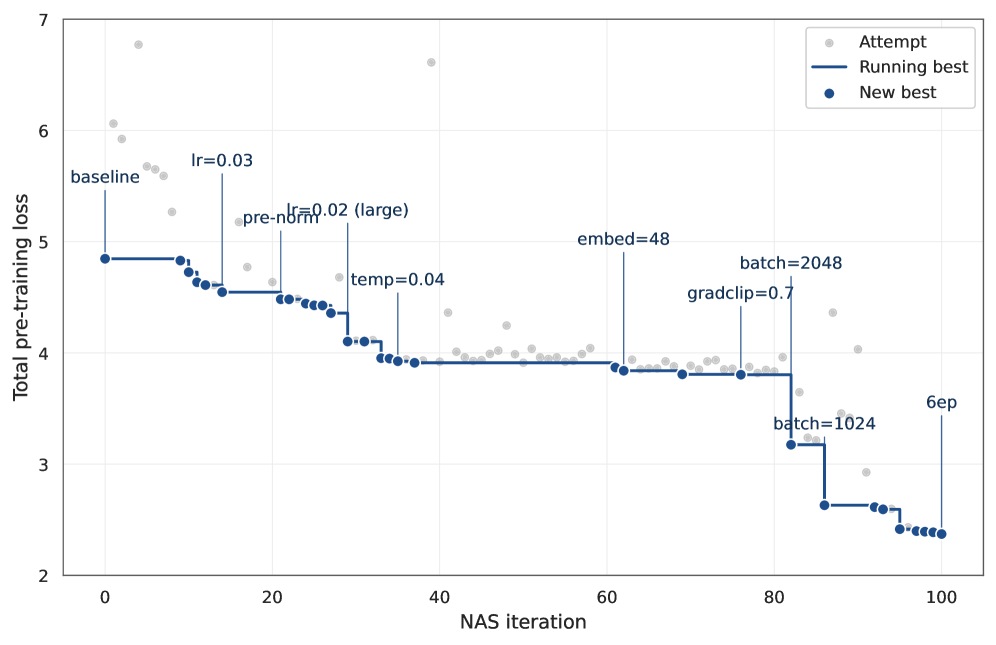

# Open-Web User Foundation Model

> **Fidelity: 核心机制复现**。实现共享序列 encoder、双视图对比预训练和下游微调。

## 论文信息

| 项目 | 内容 |
| --- | --- |
| 论文链接 | [arXiv 2607.28019](https://arxiv.org/abs/2607.28019) |
| 公司/机构 | Teads |
| 首次公开日期 | 2026-07-30（arXiv v1） |
| 原文开源代码 | 否：论文未提供官方/作者代码（核查日期：2026-08-01） |
| Adapter | `open-web-ufm` |
| 本地复现代码 | [`src/auto_research/reproductions/open_web_ufm/`](https://github.com/daiwk/auto-research/tree/main/src/auto_research/reproductions/open_web_ufm/) |

## 原始论文总结

### 背景与主要改动

开放网络 RTB 的用户身份不连续、历史短且受隐私选择影响。论文以 MLM 与序列级对比学习预训练浏览历史 Transformer，再向 CTR、赢标率等任务输出统一用户表示；训练配方由可审计 lifter 组成的 LLM-in-the-loop 搜索改进。


<!-- paper-figure:start -->
### 原论文关键图

[](https://arxiv.org/html/2607.28019v1/x1.png)

图片来自[原论文](https://arxiv.org/abs/2607.28019)，版权归原作者所有；点击图片可查看来源。
<!-- paper-figure:end -->

### 核心公式

$$
\mathcal L_{\mathrm{pre}}=\mathcal L_{\mathrm{MLM}}+\lambda\mathcal L_{\mathrm{InfoNCE}},\qquad z_u=E_\theta(s_u).
$$

### 论文离线与线上效果

生产 CTR ranker 的 RIG +1.354%，赢标率模型 RIG +1.197%；全流量 50/50、7 天 A/B 中 CTR +2.13%、eCPC -1.13%。

## 本地复现

> **本地对照口径**：基线与实验组使用同一 encoder、数据和 45 steps；实验组加入双视图预训练，相对基线 NDCG@10 **+0.00%**。

本地小切片没有显示增益，这是重要的零结果：开放网络的稀疏身份分布和 MovieLens 序列并不等价。

```bash
auto-research reproduce --paper open-web-ufm --dataset-dir data --seed 42
```

固定指标见 [`metrics/movielens-1m-seed42.json`](metrics/movielens-1m-seed42.json)。

## 复现边界

未包含 Teads RTB 私有特征、Claude Opus lifter 搜索及生产 GDCN adapter。
