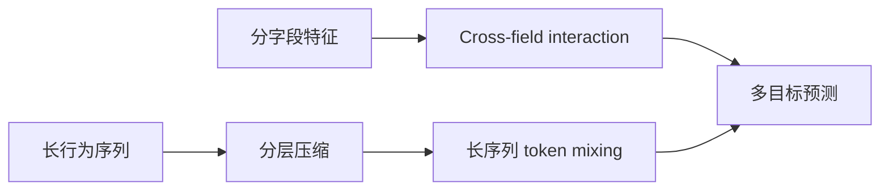
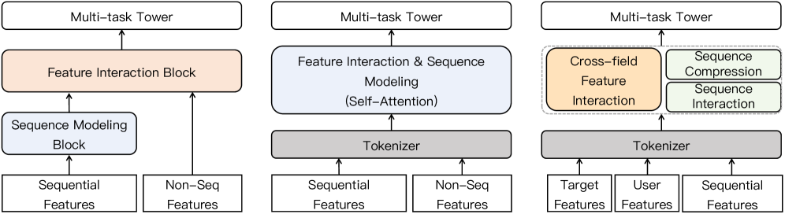

# CCFormer：跨字段交互与分层序列压缩

> **Fidelity: 核心机制复现**。实现跨字段门控、分层旧序列压缩和 recent-token 保留；不复刻腾讯私有数据与 kernel。

## 论文信息

| 项目 | 内容 |
| --- | --- |
| 论文链接 | [arXiv 2607.28070](https://arxiv.org/abs/2607.28070) |
| 公司/机构 | Tencent Platform and Content Group |
| 首次公开日期 | 2026-07-30（arXiv v1） |
| 原文开源代码 | 否：论文未提供官方/作者代码（核查日期：2026-08-01） |
| Adapter | `ccformer` |
| 本地复现代码 | [`src/auto_research/reproductions/ccformer/`](https://github.com/daiwk/auto-research/tree/main/src/auto_research/reproductions/ccformer/) |

## 原始论文总结

### 背景与主要改动

工业排序既要细粒度字段交互，又要吃进千长度行为序列。CCFormer 让 ID、内容等字段先分离投影再 cross attention，并用逐层扩大感受野的 token mixing 压缩旧历史，近期行为保持细粒度。



<!-- paper-figure:start -->
### 原论文关键图

[](https://arxiv.org/html/2607.28070v1/x1.png)

图片来自[原论文](https://arxiv.org/abs/2607.28070)，版权归原作者所有；点击图片可查看来源。
<!-- paper-figure:end -->

### 核心公式

$$
H^{(l+1)}=H^{(l)}+\operatorname{Mix}_l(\operatorname{Compress}_l(H^{(l)})),\qquad Q_f=X_fW_f^Q.
$$

### 论文离线与线上效果

腾讯两个场景每组日曝光用户超过 100 万、实验两周：视频推荐 CTR +3.57%，广告收入最高 +1.71%；上线后覆盖全部流量，相对 HSTU 训练加速 2.21 倍。

## 本地复现

> **本地对照口径**：基线为同预算 GRU；实验组为 CCFormer core，相对基线 NDCG@10 **+22.44%**。

| 模型 | Hit@10 | NDCG@10 | 实际编码 token |
|---|---:|---:|---:|
| GRU baseline | 0.0208 | 0.01092 | 24 |
| CCFormer core | **0.0292** | **0.01337** | **12** |

```bash
auto-research reproduce --paper ccformer --dataset-dir data --seed 42
```

固定指标见 [`metrics/movielens-1m-seed42.json`](metrics/movielens-1m-seed42.json)。

## 复现边界

未包含 40 亿私有样本、千长度线上序列、并行多 target kernel；本地结果只验证机制方向。
