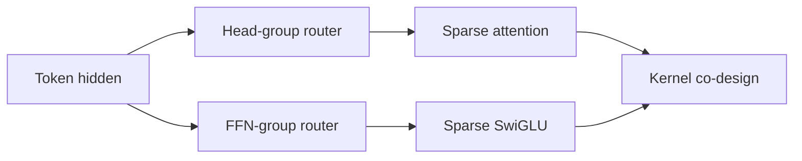
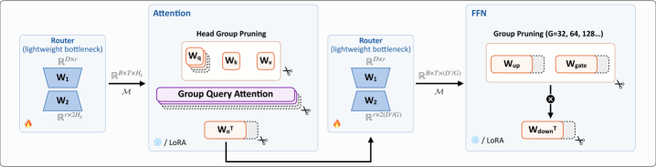

# WIDE：逐 Token 动态宽度剪枝

> **Fidelity: 核心机制复现**。实际训练 attention-head group 与 FFN-channel group router，并接入 LLM evolve。

## 论文信息

| 项目 | 内容 |
| --- | --- |
| 论文链接 | [arXiv 2607.28418](https://arxiv.org/abs/2607.28418) |
| 公司/机构 | EIT-NLP / LMU Munich |
| 首次公开日期 | 2026-07-30（arXiv v1） |
| 原文开源代码 | 是：[EIT-NLP/LLM-Pruning WIDE](https://github.com/EIT-NLP/LLM-Pruning/tree/main/WIDE) |
| Adapter | `wide` |
| 本地复现代码 | [`src/auto_research/reproductions/wide/`](https://github.com/daiwk/auto-research/tree/main/src/auto_research/reproductions/wide/) |

## 原始论文总结

### 背景与主要改动

静态剪枝无法按 token 难度分配算力，动态深度又过于粗粒度。WIDE 对每个 token 分别路由 attention head group 和 FFN channel group，并将 mask reorder、block skip 与设备内跳过联合设计。



<!-- paper-figure:start -->
### 原论文关键图

[](https://arxiv.org/html/2607.28418v1/x1.png)

图片来自[原论文](https://arxiv.org/abs/2607.28418)，版权归原作者所有；点击图片可查看来源。
<!-- paper-figure:end -->

### 核心公式

$$
m_t^A=\operatorname{TopK}(r_A(h_t)),\quad m_t^F=\operatorname{TopK}(r_F(h_t)),\quad \tilde h_t=m_t\odot h_t.
$$

### 论文离线与线上效果

50% 稀疏时相对动态深度方法性能提升 55.1%；prefill/decode kernel 最高 1.98x/4.95x，端到端 1.68x/1.55x。

## 本地复现

> **本地对照口径**：基线为同预算 dense LLaMA；实验组固定激活 50% head/channel，相对基线 perplexity **+0.81%（轻微退化）**。

```bash
auto-research reproduce --paper wide --dataset-dir data --seed 42
auto-research evolve --model micro-llm --dataset wikitext-2 --direction "比较 WIDE 动态宽度剪枝" --generations 2 --population 4
```

固定指标见 [`metrics/wikitext2-seed42.json`](metrics/wikitext2-seed42.json)。

## 复现边界

PyTorch dense kernel 不会因 mask 自动加速，因此只验证 router、稀疏率和质量变化，不冒充论文 CUDA 性能。
