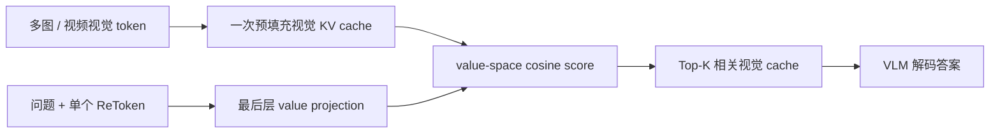
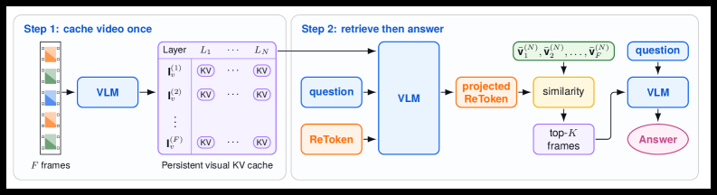

# ReToken：单 Token 的 Value-Cache 视觉检索

> **Fidelity: 核心机制复现**。实际训练单个 retrieval target、value-space projection 与稀疏 cache 选择，并接入 LLM evolve；本地文本实验不冒充完整 VLM。

## 论文信息

| 项目 | 内容 |
| --- | --- |
| 论文链接 | [arXiv 2607.28627](https://arxiv.org/abs/2607.28627) |
| 公司/机构 | UIUC / Microsoft Research / Google DeepMind |
| 首次公开日期 | 2026-07-30（arXiv v1） |
| 原文开源代码 | 是：[官方/作者代码](https://github.com/avaxiao/ReToken) |
| Adapter | `retoken` |
| 本地复现代码 | [`src/auto_research/reproductions/retoken/`](https://github.com/daiwk/auto-research/tree/main/src/auto_research/reproductions/retoken/) |

## 原始论文总结

### 背景与主要改动

常规 VLM 检索需要先用外部 retriever 找图，再把入选图重新编码，无法直接复用预填充的视觉 KV cache。ReToken 在输入中增加一个可学习 token，让它在最后一层 value projection 空间与每张图的平均 value 向量打分；只训练该 token 和一张投影矩阵，以 class-balanced BCE 监督相关/无关图，VLM 默认冻结。



<!-- paper-figure:start -->
### 原论文关键图

[](https://arxiv.org/html/2607.28627v1/x5.png)

> **原论文 Figure 4（关键图）**：展示原论文的整体流程、关键阶段及其数据流向。图片来自[原论文](https://arxiv.org/abs/2607.28627)，版权归原作者所有；点击图片可查看来源。
<!-- paper-figure:end -->

### 核心公式

$$
s_i=\cos\!\left(W_r h_{\mathrm{RET}},\,\bar v_i^{(N)}\right),\qquad
\mathcal L_{\mathrm{ret}}=-\sum_i w_{y_i}\left[y_i\log\sigma(s_i)+(1-y_i)\log(1-\sigma(s_i))\right].
$$

### 论文离线与线上效果

论文只用 MIRAGE 多图问答训练集，在 Visual Haystacks 上让 Qwen3-VL-8B 和 InternVL3.5 分别提高 13.4 与 12.4 个点；Qwen3-VL-8B 在 LVBench 零样本提高 8.0 个点。论文未报告生产线上 A/B。

## 本地复现

> **本地对照口径**：基线为同预算 dense LLaMA，实验组为 ReToken value-cache Top-K；相对基线 PPL +3.70%（变差）。

本地用 WikiText-2 同预算训练：基线是 dense LLaMA，实验组为单个可学习 retrieval target 在 value 空间对因果 cache 打分，并用 straight-through Top-K 选择 cache。30-step seed 42 中，因短前缀不足固定 Top-K，整体保留率为 74.79%；PPL 从 313.27 变为 324.86（+3.70%，退化）。该负结果保留，不写成论文视觉收益。

```bash
auto-research reproduce --paper retoken --dataset-dir data --seed 42
auto-research evolve --model micro-llm --dataset wikitext-2 --direction "比较 ReToken 的 value-cache 稀疏检索" --generations 2 --population 4
```

固定指标见 [`metrics/wikitext2-seed42.json`](metrics/wikitext2-seed42.json)。

## 复现边界

本地没有运行冻结大 VLM、MIRAGE 图文监督和两小时视频；文本 token cache 只复现论文决定性的“单 retrieval target + value-space 打分 + 稀疏选择”机制，不能与论文视觉 benchmark 数字直接比较。
