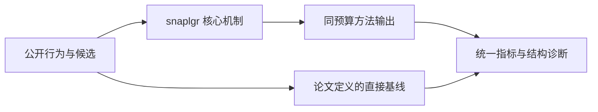
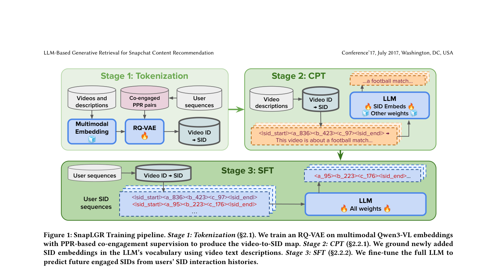

# SnapLGR：面向 Snapchat 内容推荐的 LLM 生成式召回

> **Fidelity: 核心机制复现**。本地代码执行论文最有辨识度、可由公开数据验证的机制；生产模型、私有日志与服务基础设施明确列为边界，不用普通基线冒充完整工业系统。

## 论文信息

| 项目 | 内容 |
| --- | --- |
| 论文链接 | [arXiv 2607.28895](https://arxiv.org/abs/2607.28895) |
| 公司/机构 | Snap Inc.（第一作者团队） |
| 首次公开日期 | 2026-07-30（arXiv v1） |
| 原文开源代码 | 否：论文未提供官方/作者代码（核查日期：2026-09-01） |
| Adapter | `snaplgr` |
| 本地复现代码 | [`src/auto_research/reproductions/snaplgr/`](https://github.com/daiwk/auto-research/tree/main/src/auto_research/reproductions/snaplgr/) |

## 原始论文总结

### 背景与主要改动

先从共参与图传播内容相关性，再用分层残差量化形成 semantic ID；训练时把 SID token 与真实内容表征对齐，并学习用户序列到下一 SID 的生成转移。



<!-- paper-figure:start -->
### 原论文关键图

[](https://arxiv.org/pdf/2607.28895#page=3)

> **原论文 Figure 1（关键图）**：展示原论文的整体流程、关键阶段及其数据流向。图片来自[原论文](https://arxiv.org/abs/2607.28895)，版权归原作者所有；点击图片可查看来源。
<!-- paper-figure:end -->

### 核心公式

$$
r=(1-\alpha)e_i+\alpha P^\top r,\qquad q_\ell=\arg\min_k\lVert r_{\ell-1}-c_{\ell k}\rVert^2.
$$

### 论文离线与线上效果

- 7 天生产 A/B：view time +0.37%（p=0.007）、time spent +0.09%（p=0.048）、deep sessions +0.18%；论文另报告 A100 TensorRT serving 45.7× 加速。
- 上述数字只复述论文线上证据，不写入本地公开数据的效果结论。

## 本地复现

> **本地对照口径**：基线为普通 residual SID，实验组加入共参与传播、grounding 与 SID transition；seed 42 的 NDCG@10 为 `0.01044`，基线为 `0.01753`，负结果保留。相对生产 LLM 训练的外推不适用。

三随机种子完整结果、均值、标准差与 95% CI：

- [`metrics/public-seeds42-44.json`](metrics/public-seeds42-44.json)

```bash
auto-research reproduce --paper snaplgr --dataset-dir data --seed 42
```

## 复现边界

本地使用公开 MovieLens 特征或由其构造的可审计代理任务，不能复现论文公司的私有用户日志、线上流量分配、生产模型规模和 serving 栈。因此本页只把本地结果解释为机制级验证；不将其外推为论文线上 lift，也不声称与原文绝对指标可直接比较。
