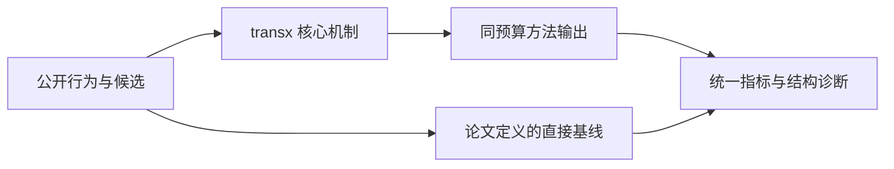
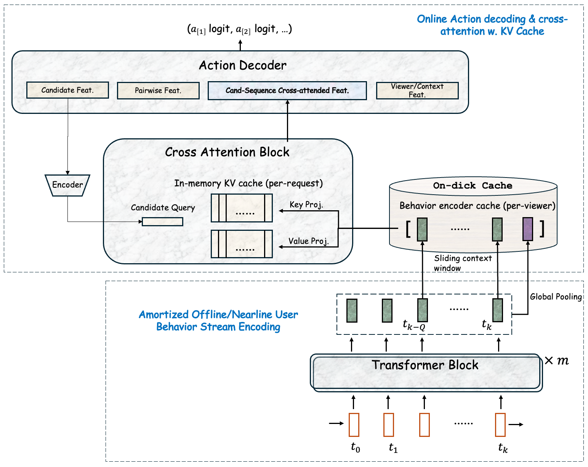

# TransX：行为流与服务流交叉的可扩展 Transformer 推荐

> **Fidelity: 核心机制复现**。本地代码执行论文最有辨识度、可由公开数据验证的机制；生产模型、私有日志与服务基础设施明确列为边界，不用普通基线冒充完整工业系统。

## 论文信息

| 项目 | 内容 |
| --- | --- |
| 论文链接 | [TheWebConf 2027 / arXiv 2607.28940](https://arxiv.org/abs/2607.28940) |
| 公司/机构 | LinkedIn（第一作者 Da Xu） |
| 首次公开日期 | 2026-07-31（arXiv v1） |
| 原文开源代码 | 否：论文未提供官方/作者代码（核查日期：2026-09-01） |
| Adapter | `transx` |
| 本地复现代码 | [`src/auto_research/reproductions/transx/`](https://github.com/daiwk/auto-research/tree/main/src/auto_research/reproductions/transx/) |

## 原始论文总结

### 背景与主要改动

将可离线缓存的长行为流与请求时产生的短服务流解耦；行为端形成 global/local 缓存，候选端只对缓存做 cross-attention，从而避免每个请求重算完整 self-attention。



<!-- paper-figure:start -->
### 原论文关键图

[](https://arxiv.org/html/2607.28940v1/images/inference.png)

> **原论文 Figure 2（关键图）**：展示原论文的整体流程、关键阶段及其数据流向。图片来自[原论文](https://arxiv.org/abs/2607.28940)，版权归原作者所有；点击图片可查看来源。
<!-- paper-figure:end -->

### 核心公式

$$
H_b=f_{cache}(x_{1:T}),\qquad h_c=\operatorname{CrossAttn}(q_c,H_b),\qquad C: T^2\rightarrow |C|\,|H_b|.
$$

### 论文离线与线上效果

- LinkedIn 大规模线上实验报告 CTR +6%、CVR +4.4%，计算量约下降 80%。
- 上述数字只复述论文线上证据，不写入本地公开数据的效果结论。

## 本地复现

> **本地对照口径**：基线为单体近期序列 scorer，实验组为缓存行为流与服务流 cross-attention；seed 42 的 NDCG@10 为 `0.04475`，基线为 `0.05401`，负结果保留。相对生产 CTR 的外推不适用。

三随机种子完整结果、均值、标准差与 95% CI：

- [`metrics/public-seeds42-44.json`](metrics/public-seeds42-44.json)

```bash
auto-research reproduce --paper transx --dataset-dir data --seed 42
```

## 复现边界

本地使用公开 MovieLens 特征或由其构造的可审计代理任务，不能复现论文公司的私有用户日志、线上流量分配、生产模型规模和 serving 栈。因此本页只把本地结果解释为机制级验证；不将其外推为论文线上 lift，也不声称与原文绝对指标可直接比较。
