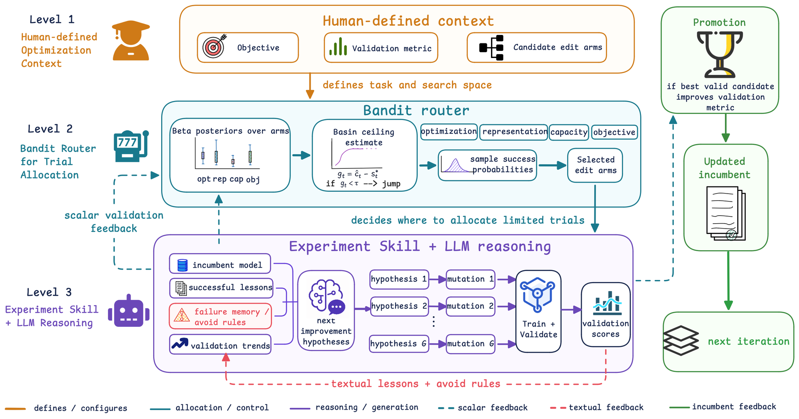

# RecHarness: A Bandit-Routed Agentic Harness for Self-Evolving Recommender Systems

> **保真度：核心机制复现**。原文结论、本地公开数据实验和未复刻部分分开陈述。

## 论文信息

| 项目 | 内容 |
| --- | --- |
| 论文链接 | [arXiv 2607.29241](https://arxiv.org/abs/2607.29241) |
| 公司/机构 | Huazhong Agricultural University (Kuaishou internship) |
| 首次公开日期 | 2026-07-31（arXiv v1） |
| 原文开源代码 | 是：[RecHarness](https://github.com/6lyc/RecHarness) |
| Adapter | `recharness` |
| 本地复现代码 | [`src/auto_research/reproductions/recharness/`](https://github.com/daiwk/auto-research/tree/main/src/auto_research/reproductions/recharness/) |

## 原始论文总结

### 背景与主要改动

将结构改造定义为有限 arm，用 bandit 根据历史收益和不确定性分配试验预算，再把胜者反馈写回下一轮候选。


<!-- paper-figure:start -->
### 原论文关键图

[](https://arxiv.org/html/2607.29241v1/g1.png)

> **原论文 Figure 1（关键图）**：展示原论文方法的总体设计和关键组成。图片来自[原论文](https://arxiv.org/abs/2607.29241)，版权归原作者所有；点击图片可查看来源。
<!-- paper-figure:end -->

### 核心公式

$$
a_t=\arg\max_a[\hat\mu_a+\sqrt{2\log t/n_a}]
$$

### 论文离线与线上效果

原文的主要线上证据为 **ADVV +2.08%**（10% traffic, 7 days）。论文离线表与线上指标使用私有或论文指定口径，不能与下面的 MovieLens 数字直接比较。

## 本地复现

> **本地对照口径**：基线为共享 transition + content scorer；实验组在相同用户、物品、全库候选和 seed 上只加入 `recharness` 核心机制，相对 NDCG@10 -9.02%。

MovieLens-100K、220 users / 360 items、seed 42：NDCG@10 0.0540 → **0.0491（-9.02%）**，Hit@10 0.1091 → 0.1000。验证集只用于选择机制混合权重，测试集没有参与调参。

```bash
auto-research reproduce --paper recharness --dataset-dir data --seed 42
```

固定指标见 [`metrics/public-seed42.json`](metrics/public-seed42.json)。

## 复现边界

在 MovieLens-100K 固定全库候选、相同切分和 seed 上执行论文核心机制；公司私有特征、生产基础模型与在线流量不可公开，论文 A/B 数字仅作原文引用。 本地实现执行了独立的模型状态和打分路径；它不是把论文名映射到同一个加权公式。未复刻项见 adapter 的 `omitted_core_components`，本地相对变化不得与原文 A/B 提升混写。
