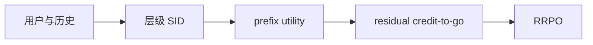
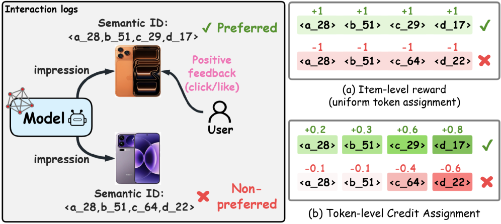

# Hierarchical Residual Policy Optimization for Generative Recommendations

> **复现级别：核心机制复现。** 论文的中心算子在本地真实执行；生产私有数据、大模型权重或专用服务未复刻，论文结果与本地结果严格分开。

## 论文信息

| 项目 | 内容 |
| --- | --- |
| 论文链接 | [KDD 2026](https://arxiv.org/abs/2608.00750) |
| 公司/机构 | City University of Hong Kong / Kuaishou |
| 首次公开日期 | 2026-08-01（arXiv v1） |
| 原文开源代码 | 是：[官方/作者代码](https://github.com/Applied-Machine-Learning-Lab/KDD2026-HRPO) |
| Adapter | `hrpo` |
| 本地复现代码 | [`src/auto_research/reproductions/hrpo/`](https://github.com/daiwk/auto-research/tree/main/src/auto_research/reproductions/hrpo/) |

## 原始论文总结

### 背景与主要改动

**主题：生成式推荐后训练。** 最终物品回报直接广播给所有 SID token 会造成稀疏且高方差的信用。HRPO 在用户簇内平滑 prefix utility，再分解 residual token credit 并累积 credit-to-go，最后用 RRPO 做保守更新。

### 主要架构



<!-- paper-figure:start -->
### 原论文关键图

[](https://arxiv.org/html/2608.00750v1/x1.png)

> **原论文 Figure 1（关键图）**：展示原论文的训练流程与关键优化环节。图片来自[原论文](https://arxiv.org/abs/2608.00750)，版权归原作者所有；点击图片可查看来源。
<!-- paper-figure:end -->

### 核心公式

$\delta_t=U(s_{\le t})-U(s_{<t}),\quad G_t=\sum_{j=t}^{T}\delta_j$

### 论文离线与线上效果

快手三个 IAA 场景 Target Cost 分别提升 +0.168%、+0.186% 和 +3.490%；论文同时报告公开数据离线增益。

## 本地复现

MovieLens-1M 上构造二进制层级 SID，实际计算 prefix smoothing、residual credit 与 credit-to-go。

运行：

```bash
auto-research reproduce --paper hrpo --dataset-dir data --seed 42
```

稳定指标保存在 [`metrics/public-seed42.json`](metrics/public-seed42.json)，不提交 checkpoint。

> **本地对照口径**：基线为去掉论文特有机制、其余数据切分与预算相同的 matched control；实验组为 `hrpo` 核心机制；相对变化见 `public-seed42.json`；跨论文百分比不适用。

## 复现边界

- 本地结果用于验证机制能执行和比较方向，不等价于原论文规模复现。
- 私有特征、线上流量和生产 serving 不可获得；原文线上数值只作为引用。
- 可接入 evolve 的结构已注册为候选；只影响 serving 的系统方法保留为独立可执行 adapter，不冒充可训练 genome。
