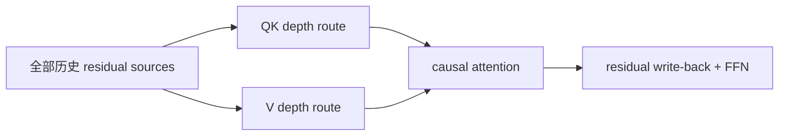
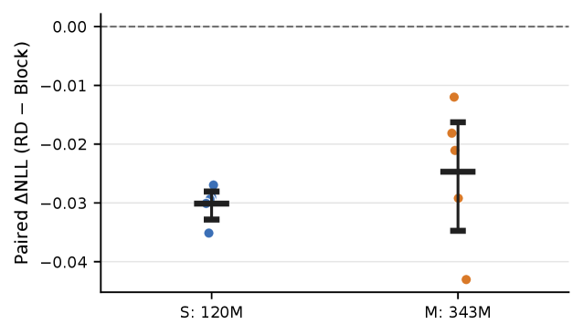

# RD-AttnRes：按 QK/V 角色解耦的残差深度路由

> **Fidelity：核心机制复现**。以共享路由的 Block AttnRes 为严格匹配基线，只增加 V 专属路由。

## 论文信息

| 项目 | 内容 |
| --- | --- |
| 论文链接 | [arXiv 2608.01075](https://arxiv.org/abs/2608.01075) |
| 公司/机构 | Kehan Wang（论文未列机构） |
| 首次公开日期 | 2026-08-03（arXiv v1） |
| 原文开源代码 | 否：论文未提供官方/作者代码（核查日期：2026-08-09） |
| Adapter | `rd-attnres` |
| 本地复现代码 | [`src/auto_research/reproductions/rd_attnres/`](https://github.com/daiwk/auto-research/tree/main/src/auto_research/reproductions/rd_attnres/) |

## 原始论文总结

### 背景与主要改动

Block AttnRes 让注意力层从全部历史 residual sources 动态读取，但 Q、K、V 共用一条深度路由。论文指出 QK 负责匹配、V 负责承载内容，两者偏好的深度未必相同；RD-AttnRes 在不改变 residual sources 和 attention 主体的情况下，只为 V 增加一个 model-width 路由向量。



<!-- paper-figure:start -->
### 原论文关键图

[](https://arxiv.org/html/2608.01075v1/x1.png)

> **原论文 Figure 2（关键图）**：展示原论文方法的总体设计和关键组成。图片来自[原论文](https://arxiv.org/abs/2608.01075)，版权归原作者所有；点击图片可查看来源。
<!-- paper-figure:end -->

### 核心公式

$$
h_{QK}^{(l)}=\sum_{j\le l}\alpha_{QK,j}^{(l)}x^{(j)},\quad
h_V^{(l)}=\sum_{j\le l}\alpha_{V,j}^{(l)}x^{(j)},\quad
y^{(l)}=\operatorname{Attn}(Q(h_{QK}),K(h_{QK}),V(h_V)).
$$

### 论文离线与线上效果

论文报告 120M 与 343M 模型 perplexity 分别相对 Block AttnRes 降低 **2.97%** 与 **2.43%**，10/10 paired runs 获胜；无生产 A/B。

## 本地复现

> **本地对照口径**：基线为共享深度路由的 Block AttnRes，实验组仅解耦 QK/V route；相对基线 PPL +0.61%（变差）。

WikiText-2、30 steps、seed 42；Block AttnRes PPL 316.41，RD-AttnRes 318.33（**+0.61%，变差**）。实验组 QK/V route JS divergence 为 0.00489，说明解耦算子被实际学习和执行，但该 micro budget 未出现论文规模收益。

```bash
auto-research reproduce --paper rd-attnres --dataset-dir data --seed 42
auto-research evolve --model micro-llm --dataset wikitext-2 --direction "比较 Block AttnRes 与 RD-AttnRes 的 QK/V 深度路由" --generations 2 --population 4
```

固定指标见 [`metrics/wikitext2-seed42.json`](metrics/wikitext2-seed42.json)。

## 复现边界

未复刻 120M/343M 预训练规模和原论文语料；本地仅验证匹配的结构消融与 evolve 接入。
