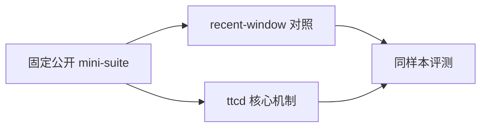
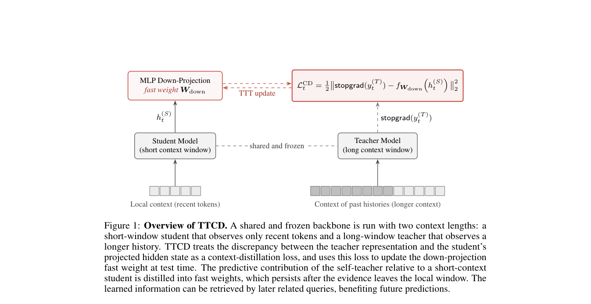

# Learning What to Remember: Test-Time Training via Context Distillation

> **复现级别：核心机制 mini-suite。** 本地只验证论文可独立实现的算法路径，不把小规模 NumPy 实验冒充原论文规模训练或线上结果。

## 论文信息

| 字段 | 内容 |
|---|---|
| 论文链接 | [arXiv 2608.01672](https://arxiv.org/abs/2608.01672) |
| 公司/机构 | Princeton University |
| 第一作者 | Zixuan Wang |
| 首次公开日期 | 2026-08-03（arXiv v1） |
| 原文开源代码 | 是：[ttcd](https://github.com/dangxingyu/ttcd) |
| Adapter | `ttcd` |
| 本地复现代码 | [`src/auto_research/reproductions/ttcd/`](https://github.com/daiwk/auto-research/tree/main/src/auto_research/reproductions/ttcd/) |

## 原始论文总结

### 背景与主要改动

长窗口教师以隐藏状态差异监督短窗口学生的 fast weights，使有限记忆优先保留未来有用信息。



<!-- paper-figure:start -->
### 原论文关键图

[](https://arxiv.org/pdf/2608.01672#page=2)

> **原论文 Figure 1（关键图）**：展示原论文方法的总体设计和关键组成。图片来自[原论文](https://arxiv.org/abs/2608.01672)，版权归原作者所有；点击图片可查看来源。
<!-- paper-figure:end -->

### 核心公式

$$
\mathcal L_{TTCD}=\sum_t\lVert h_t^{long}-h_t^{fast}\rVert_2^2
$$

### 论文离线与线上效果

IP-TTCD 在长上下文语言建模中持续优于 DeltaNet、Gated DeltaNet、滑窗注意力和 TTT。 这是原文口径；若原文没有工业 A/B，本页不会把本地结果写成线上收益。

## 本地复现

> **本地对照口径**：基线为同样本 `recent-window attention`，实验组为 `ttcd`；单 seed 变化为 `+78.12%` 个百分点。

同一 seed、同一 64 条样本上，`recent-window attention` baseline accuracy 为 `0.0781`，`ttcd` 为 `0.8594`，绝对变化 `+78.12` 个百分点。单篇原始指标见 [`metrics/public-seed42.json`](metrics/public-seed42.json)，批次索引见 [`../../experiments/historical-b07-b11-seed42.json`](../../experiments/historical-b07-b11-seed42.json)。

```bash
auto-research reproduce --paper ttcd --seed 42
```

## 复现边界

本地使用固定长上下文/多模态/评测 mini-suite，未训练论文规模 checkpoint、未实现定制 CUDA kernel，也未复刻论文完整公开 benchmark。该实现用于确认核心数据流、公式和相对计算路径可执行。
