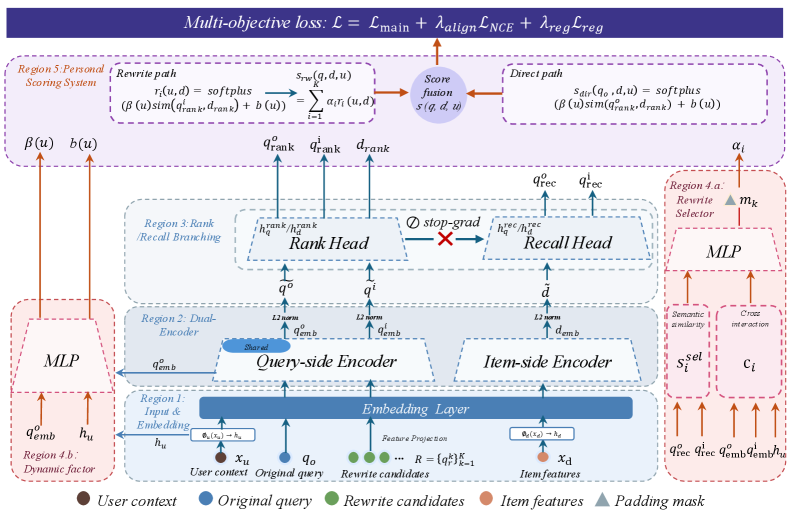

# SPEAR：选择感知的个性化改写与社区搜索

> **Fidelity：核心机制复现**。公开数据只验证论文机制，不模拟生产流量。

## 论文信息

| 项目 | 内容 |
| --- | --- |
| 论文链接 | [arXiv 2608.01738](https://arxiv.org/abs/2608.01738) |
| 公司/机构 | Dewu |
| 首次公开日期 | 2026-08-03（arXiv v1） |
| 原文开源代码 | 是：[官方/作者代码](https://github.com/mallocagi1-cell/spear) |
| Adapter | `spear` |
| 本地复现代码 | [`src/auto_research/reproductions/spear/`](https://github.com/daiwk/auto-research/tree/main/src/auto_research/reproductions/spear/) |

## 原始论文总结

### 背景与主要改动

端到端改写—检索容易让通用词凭高 path score 胜出、偏离原 query。SPEAR 用双 embedding 和梯度隔离保护 recall 语义，以 rewrite confidence × item relevance 的乘法门消除捷径，再由动态 selector 产生 request-specific 权重、scale 和 bias。


<!-- paper-figure:start -->
### 原论文关键图

[](https://arxiv.org/html/2608.01738v1/x2.png)

> **原论文 Figure 2（关键图）**：展示原论文提出的核心架构、主要模块及其连接关系。图片来自[原论文](https://arxiv.org/abs/2608.01738)，版权归原作者所有；点击图片可查看来源。
<!-- paper-figure:end -->

### 核心公式

$$
s(q',d)=s_{orig}(q,d)+\underbrace{c(q'|q,u)\cdot r(q',d)}_{\text{selection-aware gate}},\quad \hat s=\gamma(q,u)s+\beta(q,u).
$$

### 论文离线与线上效果

10 万工业 session 上 semantic similarity@10 +18.2、click recall@10 +99.5；线上 query-view CTR +0.259、平均阅读深度 +0.733，2025 年起全量部署于得物社区搜索。

## 本地复现

> **本地对照口径**：基线为共享 transition + content scorer，实验组只加入 SPEAR 核心机制；相对 NDCG@10 +26.95%。

执行 recall/rank 双 embedding、乘法 confidence×fidelity gate、dynamic scale 和原 query residual。

MovieLens-100K、260 users / 420 items、seed 42：NDCG@10 0.0354 → **0.0449（+26.95%）**；线上数值仅引用原文。

```bash
auto-research reproduce --paper spear --dataset-dir data --seed 42
auto-research evolve --model rankmixer --dataset movielens-100k --direction "探索 spear 的已安装核心算子" --generations 2 --population 4
```

固定指标见 [`metrics/public-seed42.json`](metrics/public-seed42.json)。

## 复现边界

MovieLens item 内容代理商品/帖子，未复刻得物 query rewrite generator、私有 session 与线上排序链路。
