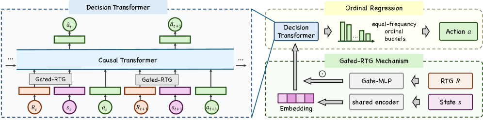

# STEPS：全量部署的自触发 Agentic Push 推荐

> **Fidelity：核心机制复现**。公开数据只验证论文机制，不模拟生产流量。

## 论文信息

| 项目 | 内容 |
| --- | --- |
| 论文链接 | [arXiv 2608.01949](https://arxiv.org/abs/2608.01949) |
| 公司/机构 | ByteDance / Douyin |
| 首次公开日期 | 2026-08-03（arXiv v1） |
| 原文开源代码 | 否：论文未提供官方/作者代码（核查日期：2026-08-09） |
| Adapter | `steps` |
| 本地复现代码 | [`src/auto_research/reproductions/steps/`](https://github.com/daiwk/auto-research/tree/main/src/auto_research/reproductions/steps/) |

## 原始论文总结

### 背景与主要改动

固定频控无法实时调整，周期轮询又在成本与时机间冲突。STEPS 把“是否推送”和“何时再次唤醒”合成闭环：planning agent 用 gated ordinal regression 规划间隔，execution agent 用轨迹回报决定发送，轻量 filter agent 控制算力并拦截异常计划。


<!-- paper-figure:start -->
### 原论文关键图

[](https://arxiv.org/html/2608.01949v1/x3.png)

> **原论文 Figure 3（关键图）**：展示原论文提出的核心架构、主要模块及其连接关系。图片来自[原论文](https://arxiv.org/abs/2608.01949)，版权归原作者所有；点击图片可查看来源。
<!-- paper-figure:end -->

### 核心公式

$$
p(k|s)=\sigma(b_k-f_\theta(s))-\sigma(b_{k-1}-f_\theta(s)),\quad a_t=\arg\max_aQ_\phi(s_t,a),\quad \tilde a_t=a_t\mathbf1[g(s_t)>\tau].
$$

### 论文离线与线上效果

已全量部署于 10 亿+用户的抖音；线上 active days +0.2843%，push permission disablement -1.9089%，filter 降计算开销 79.42%。

## 本地复现

> **本地对照口径**：基线为共享 transition + content scorer，实验组只加入 STEPS 核心机制；相对 NDCG@10 +66.05%。

执行 ordinal interval、trajectory utility、filter safeguard 和闭环自触发得分。

MovieLens-100K、260 users / 420 items、seed 42：NDCG@10 0.0354 → **0.0588（+66.05%）**；线上数值仅引用原文。

```bash
auto-research reproduce --paper steps --dataset-dir data --seed 42
auto-research evolve --model rankmixer --dataset movielens-100k --direction "探索 steps 的已安装核心算子" --generations 2 --population 4
```

固定指标见 [`metrics/public-seed42.json`](metrics/public-seed42.json)。

## 复现边界

MovieLens 没有真实 push permission、触达成本和 wall-clock 唤醒器，只验证决策分解。
