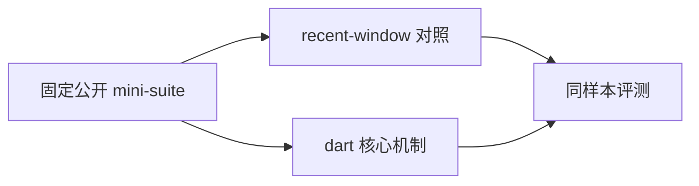
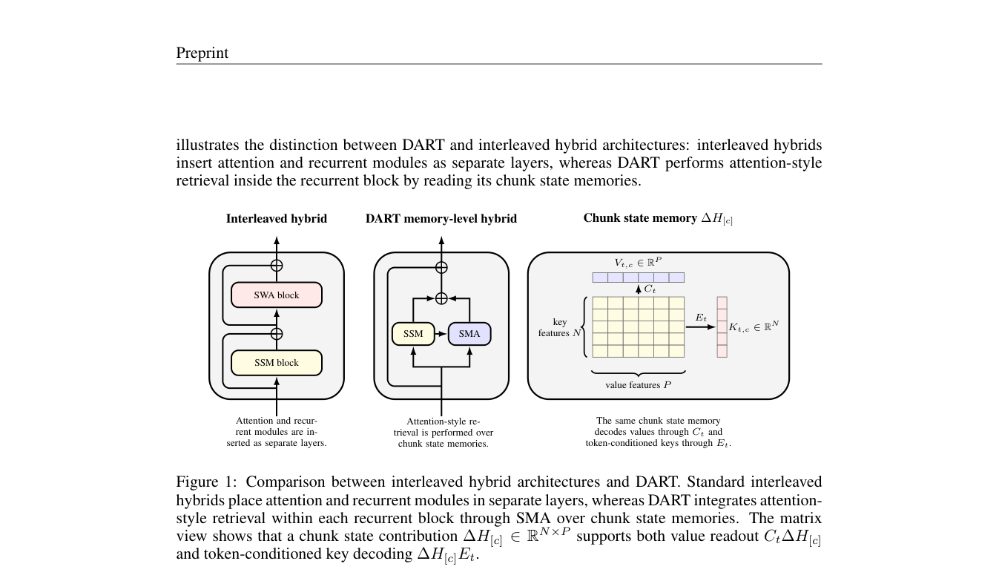

# DART: Decoded Attention over Recurrent States for Efficient Long-Context Sequence Modeling

> **复现级别：核心机制 mini-suite。** 本地只验证论文可独立实现的算法路径，不把小规模 NumPy 实验冒充原论文规模训练或线上结果。

## 论文信息

| 字段 | 内容 |
|---|---|
| 论文链接 | [arXiv 2608.02032](https://arxiv.org/abs/2608.02032) |
| 公司/机构 | Zhejiang University |
| 第一作者 | Yixiao Qian |
| 首次公开日期 | 2026-08-03（arXiv v1） |
| 原文开源代码 | 否：截至 2026-08-24 未发现原作者公开代码 |
| Adapter | `dart` |
| 本地复现代码 | [`src/auto_research/reproductions/dart/`](https://github.com/daiwk/auto-research/tree/main/src/auto_research/reproductions/dart/) |

## 原始论文总结

### 背景与主要改动

保留 Mamba-2 chunk state contributions，解码 token-conditioned K/V 并执行 state-memory attention。



<!-- paper-figure:start -->
### 原论文关键图

[](https://arxiv.org/pdf/2608.02032#page=4)

> **原论文 Figure 1（关键图）**：展示原论文提出的核心架构、主要模块及其连接关系。图片来自[原论文](https://arxiv.org/abs/2608.02032)，版权归原作者所有；点击图片可查看来源。
<!-- paper-figure:end -->

### 核心公式

$$
y_t=y_t^{Mamba}+g_t\operatorname{Attn}(q_t,K(S),V(S))
$$

### 论文离线与线上效果

chunk=256、state=128 时相对匹配 attention baseline 节省 75% 长度相关 cache。 这是原文口径；若原文没有工业 A/B，本页不会把本地结果写成线上收益。

## 本地复现

> **本地对照口径**：基线为同样本 `recent-window attention`，实验组为 `dart`；单 seed 变化为 `+3.12%` 个百分点。

同一 seed、同一 64 条样本上，`recent-window attention` baseline accuracy 为 `0.0781`，`dart` 为 `0.1094`，绝对变化 `+3.12` 个百分点。单篇原始指标见 [`metrics/public-seed42.json`](metrics/public-seed42.json)，批次索引见 [`../../experiments/historical-b07-b11-seed42.json`](../../experiments/historical-b07-b11-seed42.json)。

```bash
auto-research reproduce --paper dart --seed 42
```

## 复现边界

本地使用固定长上下文/多模态/评测 mini-suite，未训练论文规模 checkpoint、未实现定制 CUDA kernel，也未复刻论文完整公开 benchmark。该实现用于确认核心数据流、公式和相对计算路径可执行。
