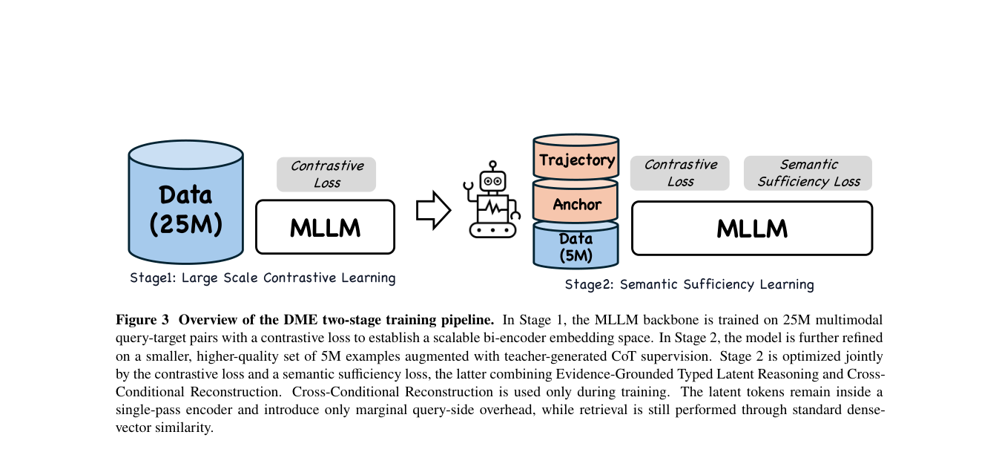

# DME：兼顾大规模召回与细粒度语义的抖音多模态向量模型

> **Fidelity：核心机制复现**。公开数据只验证论文机制，不模拟生产流量。

## 论文信息

| 字段 | 内容 |
|---|---|
| 论文链接 | [arXiv 2608.02148](https://arxiv.org/abs/2608.02148) |
| 公司/机构 | ByteDance / Douyin |
| 首次公开日期 | 2026-08-03（arXiv v1） |
| 原文开源代码 | 否：未发现/未发布官方代码（核查日期：2026-08-08） |
| Adapter | `dme` |
| 本地复现代码 | [`src/auto_research/reproductions/dme/`](https://github.com/daiwk/auto-research/tree/main/src/auto_research/reproductions/dme/) |

## 原始论文总结

### 背景与主要改动

对比学习向量服务高效但监督过粗，显式 CoT 又无法在线服务。DME 先做大规模多模态对比预训练，再以 Evidence-Grounded Typed Latent Reasoning 整理检索证据，并用 Cross-Conditional Reconstruction 保留对侧细粒度语义；两个生成头只在训练期使用。


<!-- paper-figure:start -->
### 原论文关键图

[](https://arxiv.org/pdf/2608.02148#page=7)

> **原论文 Figure 3（关键图）**：展示原论文的整体流程、关键阶段及其数据流向。图片来自[原论文](https://arxiv.org/abs/2608.02148)，版权归原作者所有；点击图片可查看来源。
<!-- paper-figure:end -->

### 核心公式

$$
z_q=E_q(q),\ z_d=E_d(d),\quad \mathcal L=\mathcal L_{contrast}+\lambda_r\mathcal L_{typed\ latent}+\lambda_c[\mathcal L(d|z_q)+\mathcal L(q|z_d)].
$$

### 论文离线与线上效果

MMEB-v2 上 2B/9B 为 74.8/78.4；抖音内部离线相对 +2.92%，搜索线上 A/B Lifetime +0.1%，且已部署于生成、图搜和 AI 搜索。

## 本地复现

> **本地对照口径**：基线为共享 transition + content scorer，实验组只加入 DME 核心机制；相对 NDCG@10 -8.84%。

执行 typed latent evidence、双向 ridge reconstruction training head 和零 serving generation head。

MovieLens-100K、260 users / 420 items、seed 42：NDCG@10 0.0354 → **0.0323（-8.84%）**；线上数值仅引用原文。

```bash
auto-research reproduce --paper dme --dataset-dir data --seed 42
auto-research evolve --model rankmixer --dataset movielens-100k --direction "探索 dme 的已安装核心算子" --generations 2 --population 4
```

固定指标见 [`metrics/public-seed42.json`](metrics/public-seed42.json)。

## 复现边界

未复刻 2B/9B 多模态 backbone、抖音私有语料和十亿级向量索引。
