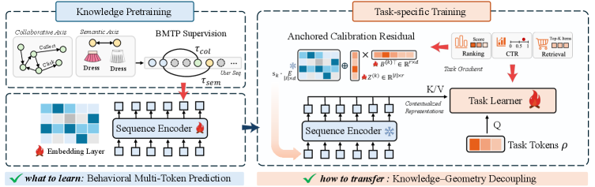

# Knowledge–Geometry Decoupling: Refreshable Pretrained Transfer for Streaming Recommendation

> **复现级别：核心机制复现。** 论文的中心算子在本地真实执行；生产私有数据、大模型权重或专用服务未复刻，论文结果与本地结果严格分开。

## 论文信息

| 项目 | 内容 |
| --- | --- |
| 论文链接 | [arXiv 2608.02738](https://arxiv.org/abs/2608.02738) |
| 公司/机构 | Xiamen University / Shopee |
| 首次公开日期 | 2026-08-03（arXiv v1） |
| 原文开源代码 | 是：[官方/作者代码](https://github.com/FuCongResearchSquad/KGD4REC) |
| Adapter | `kgd` |
| 本地复现代码 | [`src/auto_research/reproductions/kgd/`](https://github.com/daiwk/auto-research/tree/main/src/auto_research/reproductions/kgd/) |

## 原始论文总结

### 背景与主要改动

**主题：流式推荐预训练与迁移。** 相邻点击并不总是有效依赖。KGD 用 BMTP 筛出协同或语义相关的未来物品；迁移时冻结可刷新知识编码器，用只读 cross-attention 读取知识，并以与锚点正交的 ACR 写入任务几何。

### 主要架构


<!-- paper-figure:start -->
### 原论文关键图

[](https://arxiv.org/html/2608.02738v1/x2.png)

> **原论文 Figure 2（关键图）**：展示原论文方法的总体设计和关键组成。图片来自[原论文](https://arxiv.org/abs/2608.02738)，版权归原作者所有；点击图片可查看来源。
<!-- paper-figure:end -->

### 核心公式

$\mathcal L_{BMTP}=-\sum_{j\in\mathcal R_t}\log p(i_{t+j}\mid i_{\le t}),\quad r_{ACR}=r-\operatorname{proj}_{e}(r)$

### 论文离线与线上效果

8 个公开基准相对强预训练迁移基线提升 4%–12%；Shopee 首页搜索线上 GMV/user +1.75%、广告收入 +1.53%，并已全量部署。

## 本地复现

MovieLens-1M 上比较相邻 NTP 与 BMTP+冻结知识+正交 ACR，执行全库排序。

运行：

```bash
auto-research reproduce --paper kgd --dataset-dir data --seed 42
```

稳定指标保存在 [`metrics/public-seed42.json`](metrics/public-seed42.json)，不提交 checkpoint。

> **本地对照口径**：基线为去掉论文特有机制、其余数据切分与预算相同的 matched control；实验组为 `kgd` 核心机制；相对变化见 `public-seed42.json`；跨论文百分比不适用。

## 复现边界

- 本地结果用于验证机制能执行和比较方向，不等价于原论文规模复现。
- 私有特征、线上流量和生产 serving 不可获得；原文线上数值只作为引用。
- 可接入 evolve 的结构已注册为候选；只影响 serving 的系统方法保留为独立可执行 adapter，不冒充可训练 genome。
