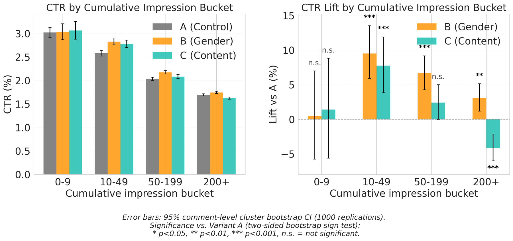

# LLM-Derived Priors for Thompson Sampling in Cold-Start Comment Recommendation

> **复现级别：核心机制复现。** 论文的中心算子在本地真实执行；生产私有数据、大模型权重或专用服务未复刻，论文结果与本地结果严格分开。

## 论文信息

| 项目 | 内容 |
| --- | --- |
| 论文链接 | [arXiv 2608.03382](https://arxiv.org/abs/2608.03382) |
| 公司/机构 | NAVER WEBTOON |
| 首次公开日期 | 2026-08-04（arXiv v1） |
| 原文开源代码 | 否：论文未提供官方/作者代码（核查日期：2026-08-09） |
| Adapter | `llm-ts-prior` |
| 本地复现代码 | [`src/auto_research/reproductions/llm_ts_prior/`](https://github.com/daiwk/auto-research/tree/main/src/auto_research/reproductions/llm_ts_prior/) |

## 原始论文总结

### 背景与主要改动

**主题：LLM 语义先验与冷启动 bandit。** 新评论缺少交互反馈，但文本已含性别/内容偏好线索。论文把 LLM 语义判断转为 Beta 伪计数，并按性别年龄分群维护 Thompson posterior。

### 主要架构


<!-- paper-figure:start -->
### 原论文关键图

[](https://arxiv.org/html/2608.03382v1/cold_start.png)

> **原论文 Figure 1（关键图）**：展示原论文方法的总体设计和关键组成。图片来自[原论文](https://arxiv.org/abs/2608.03382)，版权归原作者所有；点击图片可查看来源。
<!-- paper-figure:end -->

### 核心公式

$\theta_a\sim\operatorname{Beta}(\alpha_a,\beta_a),\quad \alpha_a=1+\kappa p_a,\ \beta_a=1+\kappa(1-p_a)$

### 论文离线与线上效果

每臂约 59.5 万用户的四周 A/B/C：Gender Prior 总体 CTR +1.48%（p=0.144，不显著），10–49 曝光冷启动段 +9.51%；Content Prior 总体 CTR -5.68%。

## 本地复现

以 MovieLens genre 代理文本语义，运行分群 Beta prior 与 40 轮 Thompson 在线更新；明确保留负向及不显著结果。

运行：

```bash
auto-research reproduce --paper llm-ts-prior --dataset-dir data --seed 42
```

稳定指标保存在 [`metrics/public-seed42.json`](metrics/public-seed42.json)，不提交 checkpoint。

> **本地对照口径**：基线为去掉论文特有机制、其余数据切分与预算相同的 matched control；实验组为 `llm-ts-prior` 核心机制；相对变化见 `public-seed42.json`；跨论文百分比不适用。

## 复现边界

- 本地结果用于验证机制能执行和比较方向，不等价于原论文规模复现。
- 私有特征、线上流量和生产 serving 不可获得；原文线上数值只作为引用。
- 可接入 evolve 的结构已注册为候选；只影响 serving 的系统方法保留为独立可执行 adapter，不冒充可训练 genome。
