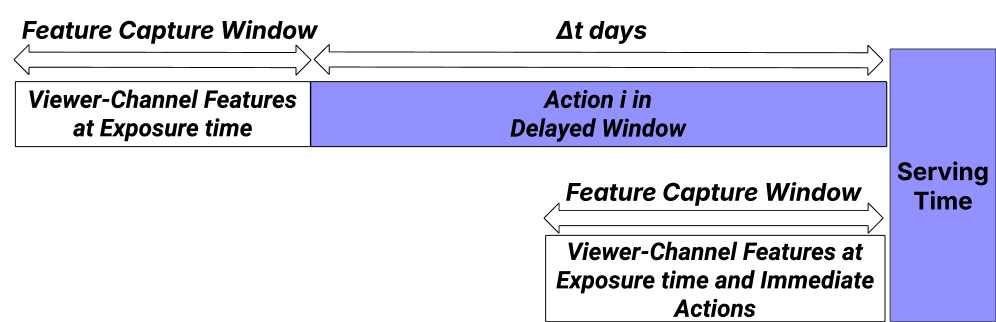

# Multi-Objective Ranking for Live-Streaming: Balancing Fresh and Delayed Signals with Segment-Aware Targeting

> **复现级别：核心机制复现。** 论文的中心算子在本地真实执行；生产私有数据、大模型权重或专用服务未复刻，论文结果与本地结果严格分开。

## 论文信息

| 字段 | 内容 |
|---|---|
| 论文链接 | [arXiv 2608.04455](https://arxiv.org/abs/2608.04455) |
| 公司/机构 | Twitch Interactive |
| 首次公开日期 | 2026-08-05（arXiv v1） |
| 原文开源代码 | 否：未发现原作者公开代码（核查日期：2026-08-09） |
| Adapter | `twitch-mor` |
| 本地复现代码 | [`src/auto_research/reproductions/twitch_mor/`](https://github.com/daiwk/auto-research/tree/main/src/auto_research/reproductions/twitch_mor/) |

## 原始论文总结

### 背景与主要改动

**主题：直播多目标排序。** 直播观看、互动、关注和付费的反馈延迟不同，且生命周期分群差异明显。论文组合即时/延迟模型、分群目标权重与 MMoE，在共享专家的同时保留目标专属 gate。

### 主要架构


<!-- paper-figure:start -->
### 原论文关键图

[](https://arxiv.org/html/2608.04455v1/x1.png)

> **原论文 Figure 1（关键图）**：展示原论文的训练流程与关键优化环节。图片来自[原论文](https://arxiv.org/abs/2608.04455)，版权归原作者所有；点击图片可查看来源。
<!-- paper-figure:end -->

### 核心公式

$y_k=\sum_e g_{k,e}(x)f_e(x),\qquad \mathcal L=\sum_k\lambda_k(s)\mathcal L_k$

### 论文离线与线上效果

线上 DAV +0.09%、高参与用户 capped ARPU +0.56%；MMoE 另带来 DAV +0.08%、新关注 +0.27%，移动 live feed 正向互动 +1.12%。

## 本地复现

MovieLens-1M 构造五个即时/延迟目标，比较单目标 DNN 与三专家生命周期 MMoE。

运行：

```bash
auto-research reproduce --paper twitch-mor --dataset-dir data --seed 42
```

稳定指标保存在 [`metrics/public-seed42.json`](metrics/public-seed42.json)，不提交 checkpoint。

> **本地对照口径**：基线为去掉论文特有机制、其余数据切分与预算相同的 matched control；实验组为 `twitch-mor` 核心机制；相对变化见 `public-seed42.json`；跨论文百分比不适用。

## 复现边界

- 本地结果用于验证机制能执行和比较方向，不等价于原论文规模复现。
- 私有特征、线上流量和生产 serving 不可获得；原文线上数值只作为引用。
- 可接入 evolve 的结构已注册为候选；只影响 serving 的系统方法保留为独立可执行 adapter，不冒充可训练 genome。
