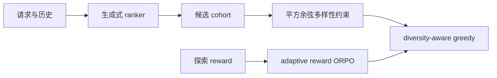
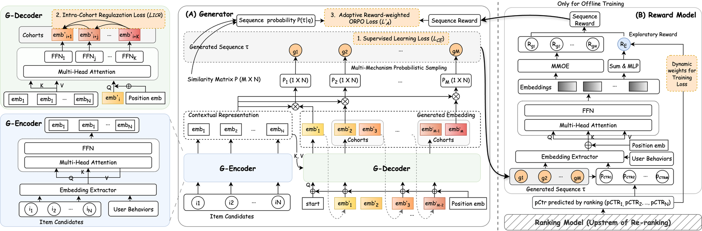

# DEGR：多样性约束与自适应奖励生成式重排

> **Fidelity：核心机制复现**。实现 next-item CE、cohort 内多样性约束、adaptive reward-weighted ORPO 和多样性感知 greedy 重排。

## 论文信息

| 项目 | 内容 |
| --- | --- |
| 论文链接 | [arXiv 2608.04809](https://arxiv.org/abs/2608.04809) |
| 公司/机构 | JD.com |
| 首次公开日期 | 2026-08-05（arXiv v1） |
| 原文开源代码 | 否：论文未提供官方/作者代码（核查日期：2026-08-09） |
| Adapter | `degr` |
| 本地复现代码 | [`src/auto_research/reproductions/degr/`](https://github.com/daiwk/auto-research/tree/main/src/auto_research/reproductions/degr/) |

## 原始论文总结

### 背景与主要改动

逐请求优化容易反复暴露相似商品。DEGR 在生成目标外加入同 cohort item embedding 的平方余弦约束，并用探索反馈形成 reward-adaptive ORPO，使偏好强度随真实探索收益变化；推理时再执行 diversity-aware greedy selection。



<!-- paper-figure:start -->
### 原论文关键图

[](https://arxiv.org/html/2608.04809v1/img/arch.png)

> **原论文 Figure 3（关键图）**：展示原论文提出的核心架构、主要模块及其连接关系。图片来自[原论文](https://arxiv.org/abs/2608.04809)，版权归原作者所有；点击图片可查看来源。
<!-- paper-figure:end -->

### 核心公式

$$
\mathcal L=\mathcal L_{CE}+\lambda_d\sum_{i<j}\cos^2(e_i,e_j)+\lambda_p\,w(r)\log\!\left(1+e^{-(s^+-s^-)}\right).
$$

### 论文离线与线上效果

京东线上 A/B 报告 **UCTR +1.22%**、**PV +0.20%**；因此满足本项目工业论文硬门槛。

## 本地复现

> **本地对照口径**：基线为同预算 CE generator，实验组加入 diversity 与 adaptive reward ORPO；相对基线 NDCG@10 +0.00%。

MovieLens-1M 260 users / 420 items、50 steps、seed 42。CE 基线和 DEGR 的 NDCG@10 均为 0.01546；DEGR 的 head-share@10 从 0.06346 降到 0.06269（**-1.21%**），执行 2,400 次 reward-ORPO 与 67,200 个 diversity pair 更新。排序质量持平、头部集中略降，不宣称复现论文线上增益。

```bash
auto-research reproduce --paper degr --dataset-dir data --seed 42
```

固定指标见 [`metrics/movielens1m-seed42.json`](metrics/movielens1m-seed42.json)。

## 复现边界

公开 MovieLens 没有跨请求曝光与探索 reward；本地以逆流行度代理奖励，未复刻京东十亿请求 reward model。
