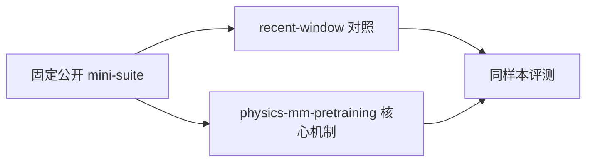
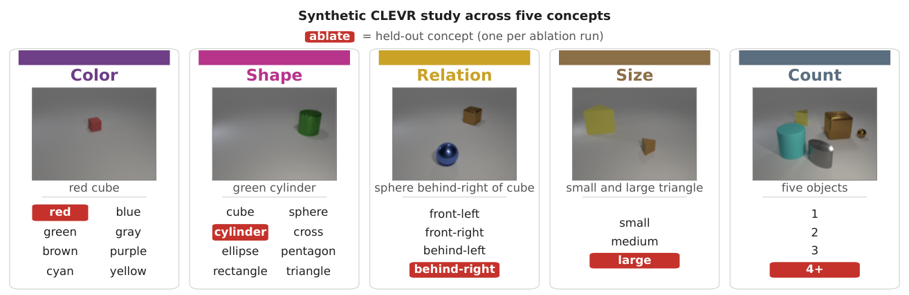

# Towards Physics of Multimodal Pretraining: Knowledge Flow, Modality Synergy, Early Unification, and Recipes

> **复现级别：核心机制 mini-suite。** 本地只验证论文可独立实现的算法路径，不把小规模 NumPy 实验冒充原论文规模训练或线上结果。

## 论文信息

| 字段 | 内容 |
|---|---|
| 论文链接 | [arXiv 2608.05000](https://arxiv.org/abs/2608.05000) |
| 公司/机构 | Meta |
| 第一作者 | Junlin Han |
| 首次公开日期 | 2026-08-05（arXiv v1） |
| 原文开源代码 | 否：截至 2026-08-24 未发现原作者公开代码 |
| Adapter | `physics-mm-pretraining` |
| 本地复现代码 | [`src/auto_research/reproductions/physics_mm_pretraining/`](https://github.com/daiwk/auto-research/tree/main/src/auto_research/reproductions/physics_mm_pretraining/) |

## 原始论文总结

### 背景与主要改动

用受控实验刻画模态知识流、协同/竞争、早期统一和共享 attention+norm/模态专属 FFN 配方。



<!-- paper-figure:start -->
### 原论文关键图

[](https://arxiv.org/html/2608.05000v2/clevr_schematic.png)

> **原论文 Figure 4（关键图）**：展示原论文的训练流程与关键优化环节。图片来自[原论文](https://arxiv.org/abs/2608.05000)，版权归原作者所有；点击图片可查看来源。
<!-- paper-figure:end -->

### 核心公式

$$
\mathcal L=\mathcal L_{text}+\lambda_u\mathcal L_{understand}+\lambda_g\mathcal L_{generate}
$$

### 论文离线与线上效果

高效配方仅用 5% 计算预算获得强生成表现，并以 13.5B MoE、2T tokens 验证。 这是原文口径；若原文没有工业 A/B，本页不会把本地结果写成线上收益。

## 本地复现

> **本地对照口径**：基线为同样本 `single-modality representation`，实验组为 `physics-mm-pretraining`；单 seed 变化为 `+0.00%` 个百分点。

同一 seed、同一 64 条样本上，`single-modality representation` baseline accuracy 为 `1.0000`，`physics-mm-pretraining` 为 `1.0000`，绝对变化 `+0.00` 个百分点。单篇原始指标见 [`metrics/public-seed42.json`](metrics/public-seed42.json)，批次索引见 [`../../experiments/historical-b07-b11-seed42.json`](../../experiments/historical-b07-b11-seed42.json)。

```bash
auto-research reproduce --paper physics-mm-pretraining --seed 42
```

## 复现边界

本地使用固定长上下文/多模态/评测 mini-suite，未训练论文规模 checkpoint、未实现定制 CUDA kernel，也未复刻论文完整公开 benchmark。该实现用于确认核心数据流、公式和相对计算路径可执行。
