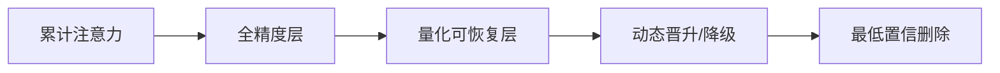
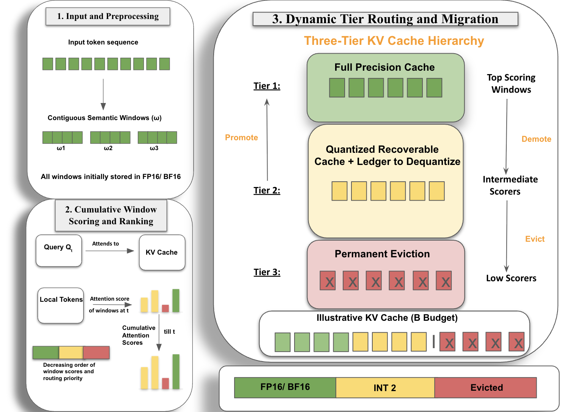

# QEvict: Recoverable Quantized KV Eviction for Attention-Drift-Robust Long-Context Decoding

> **复现级别：核心机制复现。** 论文的中心算子在本地真实执行；生产私有数据、大模型权重或专用服务未复刻，论文结果与本地结果严格分开。

## 论文信息

| 字段 | 内容 |
|---|---|
| 论文链接 | [arXiv 2608.05326](https://arxiv.org/abs/2608.05326) |
| 公司/机构 | Indian Institute of Technology Roorkee |
| 首次公开日期 | 2026-08-05（arXiv v1） |
| 原文开源代码 | 否：未发现原作者公开代码（核查日期：2026-08-09） |
| Adapter | `qevict` |
| 本地复现代码 | [`src/auto_research/reproductions/qevict/`](https://github.com/daiwk/auto-research/tree/main/src/auto_research/reproductions/qevict/) |

## 原始论文总结

### 背景与主要改动

**主题：长上下文 KV cache。** 二元保留/删除无法应对注意力漂移：今天不重要的窗口可能稍后重新活跃。QEvict 设置全精度、量化可恢复、删除三层，累计注意力变化时可将窗口解量化晋升。

### 主要架构



<!-- paper-figure:start -->
### 原论文关键图

[](https://arxiv.org/html/2608.05326v1/framework_new.png)

> **原论文 Figure 2（关键图）**：展示原论文的整体流程、关键阶段及其数据流向。图片来自[原论文](https://arxiv.org/abs/2608.05326)，版权归原作者所有；点击图片可查看来源。
<!-- paper-figure:end -->

### 核心公式

$s_i^{(t)}=\gamma s_i^{(t-1)}+a_i^{(t)},\quad q_i\rightarrow f_i\ \text{if }s_i^{(t)}>\tau$

### 论文离线与线上效果

长上下文理解、检索和推理基准持续优于代表性 eviction/quantization 基线；论文摘要未提供统一百分比。

## 本地复现

在固定槽位预算的向量 attention 流上执行三层缓存、量化恢复与晋升，比较不可恢复 eviction recall。

运行：

```bash
auto-research reproduce --paper qevict --dataset-dir data --seed 42
```

稳定指标保存在 [`metrics/public-seed42.json`](metrics/public-seed42.json)，不提交 checkpoint。

> **本地对照口径**：基线为去掉论文特有机制、其余数据切分与预算相同的 matched control；实验组为 `qevict` 核心机制；相对变化见 `public-seed42.json`；跨论文百分比不适用。

## 复现边界

- 本地结果用于验证机制能执行和比较方向，不等价于原论文规模复现。
- 私有特征、线上流量和生产 serving 不可获得；原文线上数值只作为引用。
- 可接入 evolve 的结构已注册为候选；只影响 serving 的系统方法保留为独立可执行 adapter，不冒充可训练 genome。
