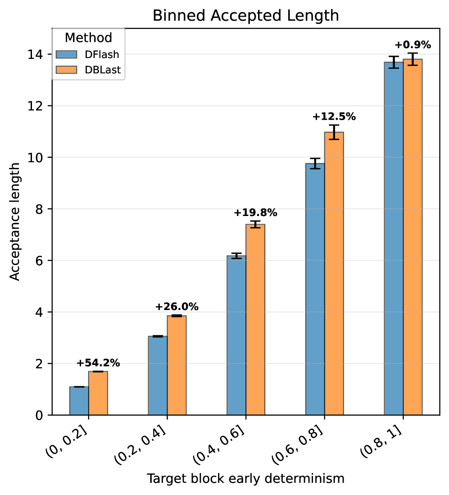

# DBLast: Dependent Block Drafting for Stochastic Speculative Decoding

> **复现级别：核心机制复现。** 论文的中心算子在本地真实执行；生产私有数据、大模型权重或专用服务未复刻，论文结果与本地结果严格分开。

## 论文信息

| 项目 | 内容 |
| --- | --- |
| 论文链接 | [arXiv 2608.05448](https://arxiv.org/abs/2608.05448) |
| 公司/机构 | Huawei Technologies Canada |
| 首次公开日期 | 2026-08-05（arXiv v1） |
| 原文开源代码 | 否：论文未提供官方/作者代码（核查日期：2026-08-09） |
| Adapter | `dblast` |
| 本地复现代码 | [`src/auto_research/reproductions/dblast/`](https://github.com/daiwk/auto-research/tree/main/src/auto_research/reproductions/dblast/) |

## 原始论文总结

### 背景与主要改动

**主题：推测解码。** 并行 block drafter 常把位置条件独立化，在高熵采样时难以匹配联合分布。DBLast 用跨位置共享的低秩 latent mixture 建模依赖，并以期望验证长度为训练目标。

### 主要架构


<!-- paper-figure:start -->
### 原论文关键图

[](https://arxiv.org/html/2608.05448v1/x1.png)

> **原论文 Figure 1（关键图）**：展示原论文方法的总体设计和关键组成。图片来自[原论文](https://arxiv.org/abs/2608.05448)，版权归原作者所有；点击图片可查看来源。
<!-- paper-figure:end -->

### 核心公式

$q(y_{1:B}\mid x)=\int p(z)\prod_{b=1}^{B}q(y_b\mid x,z)\,dz$

### 论文离线与线上效果

Qwen3-4B/8B 上覆盖 GSM8K、MT-Bench、HumanEval 与创作任务，高熵区间持续提高 accepted draft length；摘要未列统一值。

## 本地复现

用 32-token Markov target 比较 unigram 独立 proposal 与 rank-4 条件 proposal，并按精确 speculative acceptance 估计接受长度。

运行：

```bash
auto-research reproduce --paper dblast --dataset-dir data --seed 42
```

稳定指标保存在 [`metrics/public-seed42.json`](metrics/public-seed42.json)，不提交 checkpoint。

> **本地对照口径**：基线为去掉论文特有机制、其余数据切分与预算相同的 matched control；实验组为 `dblast` 核心机制；相对变化见 `public-seed42.json`；跨论文百分比不适用。

## 复现边界

- 本地结果用于验证机制能执行和比较方向，不等价于原论文规模复现。
- 私有特征、线上流量和生产 serving 不可获得；原文线上数值只作为引用。
- 可接入 evolve 的结构已注册为候选；只影响 serving 的系统方法保留为独立可执行 adapter，不冒充可训练 genome。
