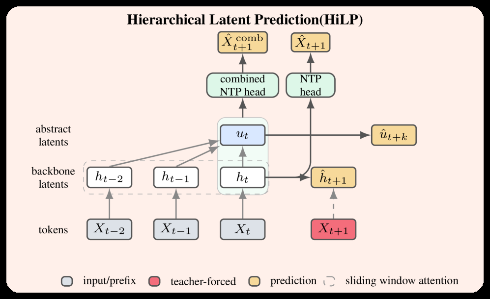

# Hierarchical Latent Prediction for Language Models

> **复现级别：核心机制复现。** 论文的中心算子在本地真实执行；生产私有数据、大模型权重或专用服务未复刻，论文结果与本地结果严格分开。

## 论文信息

| 项目 | 内容 |
| --- | --- |
| 论文链接 | [arXiv 2608.05806](https://arxiv.org/abs/2608.05806) |
| 公司/机构 | University of Texas at Austin |
| 首次公开日期 | 2026-08-06（arXiv v1） |
| 原文开源代码 | 否：论文未提供官方/作者代码（核查日期：2026-08-09） |
| Adapter | `hilp` |
| 本地复现代码 | [`src/auto_research/reproductions/hilp/`](https://github.com/daiwk/auto-research/tree/main/src/auto_research/reproductions/hilp/) |

## 原始论文总结

### 背景与主要改动

**主题：分层 latent 预训练。** NextLat 的逐步 latent rollout 会累积误差。HiLP 增加更粗粒度的抽象 latent 目标，让局部状态同时受长时间尺度结构约束。

### 主要架构


<!-- paper-figure:start -->
### 原论文关键图

[](https://arxiv.org/html/2608.05806v1/x1.png)

> **原论文 Figure 1（关键图）**：展示原论文方法的总体设计和关键组成。图片来自[原论文](https://arxiv.org/abs/2608.05806)，版权归原作者所有；点击图片可查看来源。
<!-- paper-figure:end -->

### 核心公式

$\mathcal L=\mathcal L_{NTP}+\lambda_1\lVert\hat z_{t+1}-z_{t+1}\rVert^2+\lambda_H\lVert\hat h_{k+1}-h_{k+1}\rVert^2$

### 论文离线与线上效果

论文在代码与多步推理基准展示更连贯的长时程 belief state，并提高 speculative decoding 效率；摘要未给统一单一提升值。

## 本地复现

合成多尺度序列上比较 next-latent 与加入块级 abstract latent 的预测误差；结构也接入 micro-LLM evolve。

运行：

```bash
auto-research reproduce --paper hilp --dataset-dir data --seed 42
```

稳定指标保存在 [`metrics/public-seed42.json`](metrics/public-seed42.json)，不提交 checkpoint。

> **本地对照口径**：基线为去掉论文特有机制、其余数据切分与预算相同的 matched control；实验组为 `hilp` 核心机制；相对变化见 `public-seed42.json`；跨论文百分比不适用。

## 复现边界

- 本地结果用于验证机制能执行和比较方向，不等价于原论文规模复现。
- 私有特征、线上流量和生产 serving 不可获得；原文线上数值只作为引用。
- 可接入 evolve 的结构已注册为候选；只影响 serving 的系统方法保留为独立可执行 adapter，不冒充可训练 genome。
