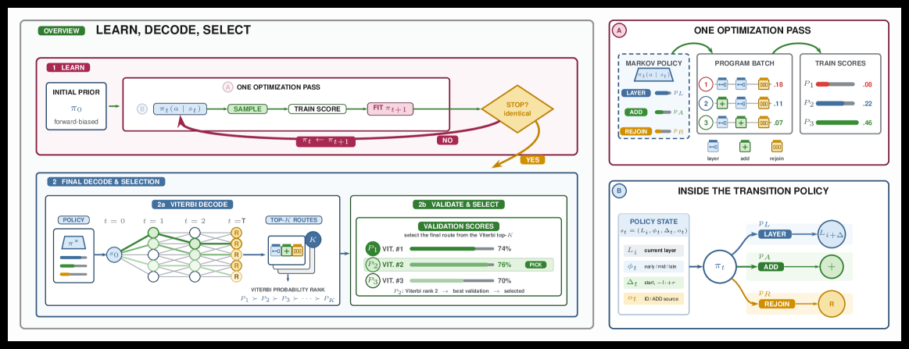

# MACRO: Markov Chain Routing of Transformer Layers

> **复现级别：核心机制复现。** 论文的中心算子在本地真实执行；生产私有数据、大模型权重或专用服务未复刻，论文结果与本地结果严格分开。

## 论文信息

| 项目 | 内容 |
| --- | --- |
| 论文链接 | [arXiv 2608.05872](https://arxiv.org/abs/2608.05872) |
| 公司/机构 | Heinrich Heine University Düsseldorf |
| 首次公开日期 | 2026-08-06（arXiv v1） |
| 原文开源代码 | 是：[官方/作者代码](https://github.com/Batorskq/MACRO) |
| Adapter | `macro` |
| 本地复现代码 | [`src/auto_research/reproductions/macro/`](https://github.com/daiwk/auto-research/tree/main/src/auto_research/reproductions/macro/) |

## 原始论文总结

### 背景与主要改动

**主题：动态层路由。** 固定顺序执行所有 Transformer 层并非总是最优。MACRO 用上下文条件 Markov policy 表示 skip、repeat、residual-add 等操作，再用反馈更新路由分布和 top-k Viterbi 解码候选程序，不修改底座权重。

### 主要架构


<!-- paper-figure:start -->
### 原论文关键图

[](https://arxiv.org/html/2608.05872v1/x2.png)

> **原论文 Figure 2（关键图）**：展示原论文的整体流程、关键阶段及其数据流向。图片来自[原论文](https://arxiv.org/abs/2608.05872)，版权归原作者所有；点击图片可查看来源。
<!-- paper-figure:end -->

### 核心公式

$p(\rho\mid x)=\prod_t\pi(a_t\mid \ell_t,b_t,d_t,x)$

### 论文离线与线上效果

平均准确率相对顺序执行 +5.0%，相对 Dr. LLM +7.2 个点；搜索时间由 14.8 小时降至 1.6 小时（9.4×）。

## 本地复现

在确定性分类 mini-suite 搜索 81 条 skip/repeat/residual 路由；同时作为 micro-LLM evolve 的可选结构。

运行：

```bash
auto-research reproduce --paper macro --dataset-dir data --seed 42
```

稳定指标保存在 [`metrics/public-seed42.json`](metrics/public-seed42.json)，不提交 checkpoint。

> **本地对照口径**：基线为去掉论文特有机制、其余数据切分与预算相同的 matched control；实验组为 `macro` 核心机制；相对变化见 `public-seed42.json`；跨论文百分比不适用。

## 复现边界

- 本地结果用于验证机制能执行和比较方向，不等价于原论文规模复现。
- 私有特征、线上流量和生产 serving 不可获得；原文线上数值只作为引用。
- 可接入 evolve 的结构已注册为候选；只影响 serving 的系统方法保留为独立可执行 adapter，不冒充可训练 genome。
