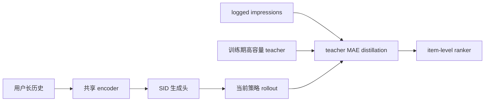
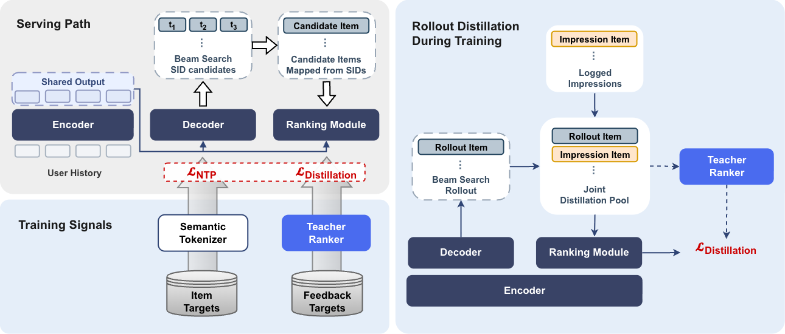

# Gryphon-v2：生成、预排与排序一体化音乐推荐

> **Fidelity：核心机制复现**。实现共享历史编码器、生成头、训练期 teacher、双来源 rollout 蒸馏与 item-level ranker；本地负结果如实保留。

## 论文信息

| 字段 | 内容 |
|---|---|
| 论文链接 | [arXiv 2608.06213](https://arxiv.org/abs/2608.06213) |
| 公司/机构 | Yandex |
| 首次公开日期 | 2026-08-06（arXiv v1） |
| 原文开源代码 | 否：未发现/未发布官方实现（核查日期：2026-08-08） |
| Adapter | `gryphon-v2` |
| 本地复现代码 | [`src/auto_research/reproductions/gryphon_v2/`](https://github.com/daiwk/auto-research/tree/main/src/auto_research/reproductions/gryphon_v2/) |

## 原始论文总结

### 背景与主要改动

Yandex 原系统包含 15 个以上召回器和独立预排/排序。Gryphon-v2 复用生成式推荐的共享 history encoder：生成头预测 Semantic ID，item-level ranking head 对生成候选直接排序；离线高容量 teacher 同时监督当前模型 rollout 和 logged impressions，从而让排序器见到 serving 分布与真实曝光分布。



<!-- paper-figure:start -->
### 原论文关键图

[](https://arxiv.org/html/2608.06213v1/source/images/paper_gryphon_v2_6.png)

> **原论文 Figure 1（关键图）**：展示原论文提出的核心架构、主要模块及其连接关系。图片来自[原论文](https://arxiv.org/abs/2608.06213)，版权归原作者所有；点击图片可查看来源。
<!-- paper-figure:end -->

### 核心公式

$$
\mathcal L=\mathcal L_{\mathrm{NTP}}+\lambda_r\,\mathbb E_{i\in C_{\mathrm{rollout}}\cup C_{\mathrm{impression}}}|s_\theta(i)-s_T(i)|.
$$

### 论文离线与线上效果

离线 teacher Recall@10 为 0.5654、weighted pair accuracy 为 0.5892；替换 15+ 召回、预排与排序模块后，在相近延迟下 Yandex Music **active users +1.41%**，并已进入生产链路。

## 本地复现

> **本地对照口径**：基线为同预算生成式召回，实验组加入双来源蒸馏与 ranker；相对基线 NDCG@10 -26.84%。

MovieLens-1M 260 users / 420 items、50 steps、seed 42。生成基线 NDCG@10 0.01546；Gryphon-v2 路径 0.01131（**-26.84%**），Hit@10 -11.11%，且执行了 57,600 个 rollout 和 57,600 个 impression 蒸馏目标。小数据与短训练下 teacher/ranker 发生负迁移，不能据此否定原论文，也绝不写成线上 +1.41% 的本地复现。

```bash
auto-research reproduce --paper gryphon-v2 --dataset-dir data --seed 42
```

固定指标见 [`metrics/movielens1m-seed42.json`](metrics/movielens1m-seed42.json)。

## 复现边界

未复刻 Yandex 私有音乐/多模态 SID、8,000 长历史、十分钟在线更新和 Triton serving；公开数据只验证核心训练数据流。
