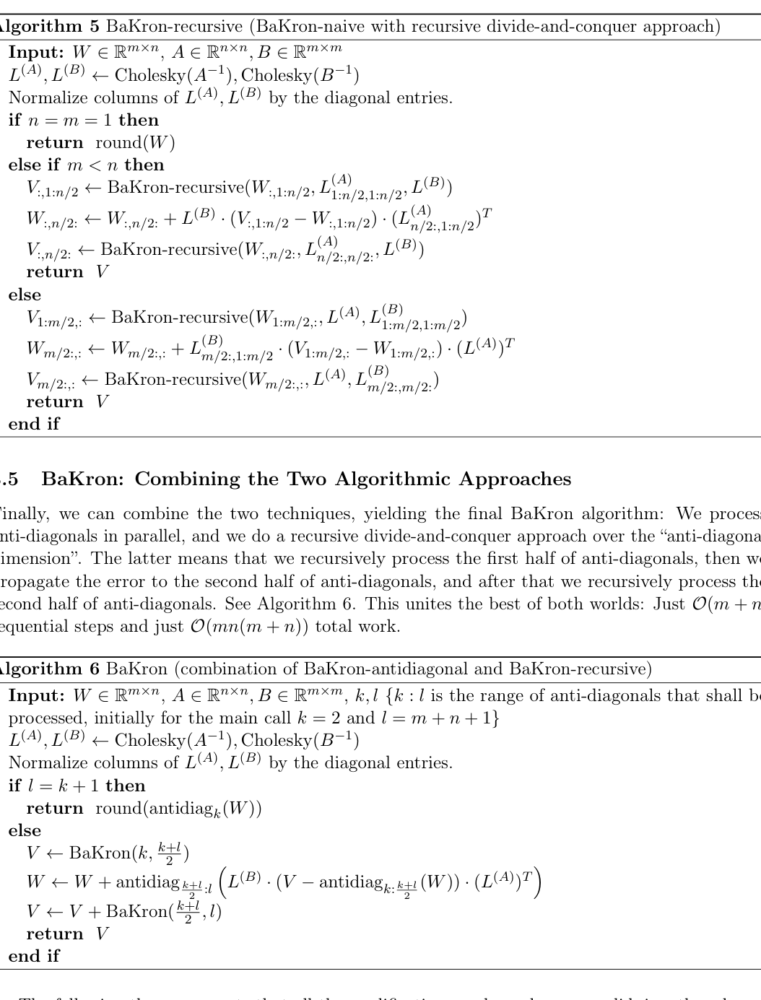

# BaKron: Efficient Quantization with Kronecker-Factored Hessians

> **复现级别：核心机制复现。** 论文的中心算子在本地真实执行；生产私有数据、大模型权重或专用服务未复刻，论文结果与本地结果严格分开。

## 论文信息

| 项目 | 内容 |
| --- | --- |
| 论文链接 | [arXiv 2608.06291](https://arxiv.org/abs/2608.06291) |
| 公司/机构 | University of California, San Diego |
| 首次公开日期 | 2026-08-06（arXiv v1） |
| 原文开源代码 | 否：论文未提供官方/作者代码（核查日期：2026-08-09） |
| Adapter | `bakron` |
| 本地复现代码 | [`src/auto_research/reproductions/bakron/`](https://github.com/daiwk/auto-research/tree/main/src/auto_research/reproductions/bakron/) |

## 原始论文总结

### 背景与主要改动

**主题：二阶量化。** GPTQ 通常只利用输入侧曲率；双侧 Kronecker Hessian 更丰富但直接向量化求解昂贵。BaKron 以反对角并行和递归分治实现双侧自适应 rounding。

### 主要架构


<!-- paper-figure:start -->
### 原论文关键图

[](https://arxiv.org/pdf/2608.06291#page=7)

> **原论文 Algorithm 5–6（关键图）**：展示原论文方法的总体设计和关键组成。图片来自[原论文](https://arxiv.org/abs/2608.06291)，版权归原作者所有；点击图片可查看来源。
<!-- paper-figure:end -->

### 核心公式

$\min_{\hat W}\operatorname{vec}(W-\hat W)^\top(A\otimes B)\operatorname{vec}(W-\hat W)$

### 论文离线与线上效果

顺序步数为 O(m+n)，总工作量由 O(m²n²) 降到 O(mn(m+n))，达到 GPTQ 同阶复杂度同时使用双侧曲率。

## 本地复现

对随机权重执行 Kronecker 加权 4-bit rounding 与逐行尺度搜索，和全局 GPTQ-style rounding 比较加权误差。

运行：

```bash
auto-research reproduce --paper bakron --dataset-dir data --seed 42
```

稳定指标保存在 [`metrics/public-seed42.json`](metrics/public-seed42.json)，不提交 checkpoint。

> **本地对照口径**：基线为去掉论文特有机制、其余数据切分与预算相同的 matched control；实验组为 `bakron` 核心机制；相对变化见 `public-seed42.json`；跨论文百分比不适用。

## 复现边界

- 本地结果用于验证机制能执行和比较方向，不等价于原论文规模复现。
- 私有特征、线上流量和生产 serving 不可获得；原文线上数值只作为引用。
- 可接入 evolve 的结构已注册为候选；只影响 serving 的系统方法保留为独立可执行 adapter，不冒充可训练 genome。
