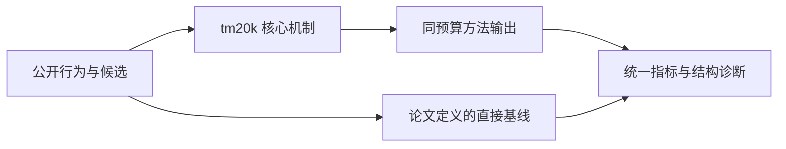
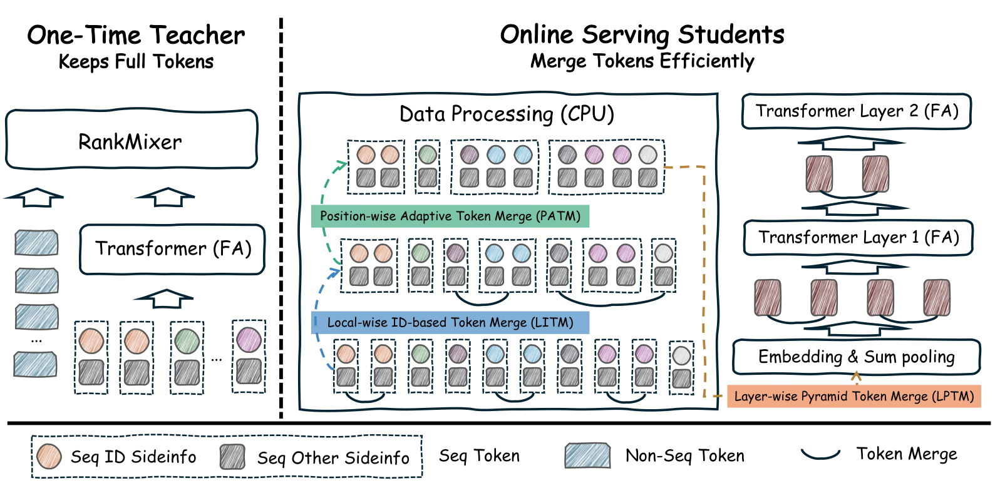

# TM20K：教师保留全 token、学生高效合并的超长行为建模

> **Fidelity: 核心机制复现**。本地代码执行论文最有辨识度、可由公开数据验证的机制；生产模型、私有日志与服务基础设施明确列为边界，不用普通基线冒充完整工业系统。

## 论文信息

| 项目 | 内容 |
| --- | --- |
| 论文链接 | [arXiv 2608.07055](https://arxiv.org/abs/2608.07055) |
| 公司/机构 | 字节跳动（第一作者团队） |
| 首次公开日期 | 2026-08-07（arXiv v1） |
| 原文开源代码 | 否：论文未提供官方/作者代码（核查日期：2026-09-01） |
| Adapter | `tm20k` |
| 本地复现代码 | [`src/auto_research/reproductions/tm20k/`](https://github.com/daiwk/auto-research/tree/main/src/auto_research/reproductions/tm20k/) |

## 原始论文总结

### 背景与主要改动

教师网络保留完整行为 token 提供细粒度监督，学生把连续行为按组以 sum/√n 合并到固定 token 预算，再蒸馏教师注意力与排序分布，兼顾长序列信息和线上成本。



<!-- paper-figure:start -->
### 原论文关键图

[](https://arxiv.org/html/2608.07055v2/method.png)

> **原论文 Figure 4（关键图）**：展示原论文提出的核心架构、主要模块及其连接关系。图片来自[原论文](https://arxiv.org/abs/2608.07055)，版权归原作者所有；点击图片可查看来源。
<!-- paper-figure:end -->

### 核心公式

$$
m_g=|G_g|^{-1/2}\sum_{t\in G_g}e_t,\qquad \mathcal L=\mathcal L_{rank}+\alpha\lVert A_{student}-A_{teacher}\rVert_2^2.
$$

### 论文离线与线上效果

- 5 天线上实验覆盖数亿用户：ADSS +1.036%、ADVV +0.780%，延迟增加 5.6%。
- 上述数字只复述论文线上证据，不写入本地公开数据的效果结论。

## 本地复现

> **本地对照口径**：基线为无蒸馏的合并 token student，实验组从 full-token teacher 蒸馏；seed 42 的 NDCG@10 为 `0.04022`，基线为 `0.03446`。相对 20K 私有序列的外推不适用。

三随机种子完整结果、均值、标准差与 95% CI：

- [`metrics/public-seeds42-44.json`](metrics/public-seeds42-44.json)

```bash
auto-research reproduce --paper tm20k --dataset-dir data --seed 42
```

## 复现边界

本地使用公开 MovieLens 特征或由其构造的可审计代理任务，不能复现论文公司的私有用户日志、线上流量分配、生产模型规模和 serving 栈。因此本页只把本地结果解释为机制级验证；不将其外推为论文线上 lift，也不声称与原文绝对指标可直接比较。
