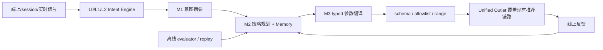
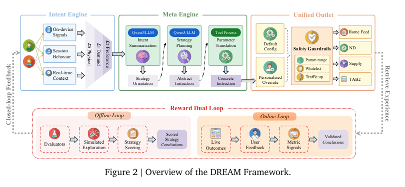

# DREAM：由 LLM 驱动的推荐双环持续进化框架

> **Fidelity：核心机制复现。** 保留原推荐 backbone，实际执行分层意图、策略记忆、typed 参数编译、安全护栏及离线/影子在线双环；不以普通重排器代替核心控制链路。

## 论文信息

| 项目 | 内容 |
| --- | --- |
| 论文链接 | [arXiv 2608.09408](https://arxiv.org/abs/2608.09408) |
| 公司/机构 | Taobao & Tmall Group / Alibaba |
| 首次公开日期 | 2026-08-10（arXiv v1） |
| 原文开源代码 | 否：截至 2026-08-20 未发现原作者公开代码 |
| Adapter | `dream` |
| 本地复现代码 | [`src/auto_research/reproductions/dream/`](https://github.com/daiwk/auto-research/tree/main/src/auto_research/reproductions/dream/) |

## 原始论文总结

### 背景与主要改动

工业推荐长期依赖人工配置和逐层独立优化，LLM 若直接生成自由文本又难以满足稳定性与安全要求。DREAM 是覆盖现有召回、精排和重排之上的控制平面：Intent Engine 将端上信号、session 行为和实时上下文整理成 L0 物理、L1 需求、L2 偏好三层意图；Meta Engine 依次执行 M1 意图摘要、M2 结合 Strategy Memory 的策略规划和 M3 确定性参数翻译；Unified Outlet 只接受白名单、范围内的 typed 参数。离线 evaluator 探索并评分策略，线上结果验证结论后回存 Memory，形成 Reward Dual Loop。



<!-- paper-figure:start -->
### 原论文关键图

[](https://arxiv.org/pdf/2608.09408#page=5)

> 原论文 Figure 2：Intent Engine、Meta Engine、Unified Outlet 和 Reward Dual Loop 的完整闭环。图片来自[原论文](https://arxiv.org/pdf/2608.09408#page=5)，版权归原作者所有。
<!-- paper-figure:end -->

### 核心公式

对原排序权重 $w_i^0$，Meta Engine 只产生有界语义级别 $b_i\in\{-2,-1,0,1,2\}$，编译为乘法覆盖：

$$
\delta_i=w_i^0b_i,\qquad
f_{\mathrm{rank}}=f_{\mathrm{ltr}}\prod_i(1+\delta_i\hat v_i).
$$

类目打散同样只改变允许范围内的个数：

$$
n_{\mathrm{new}}=\max(1,n_{\mathrm{default}}+b_c).
$$

### 论文离线与线上效果

- 意图模型整体分从 baseline **71.32** 提升到“routing + self-evolution”的 **84.74**。
- 淘宝首页线上：仅重排 IPV/Core IPV/GMV **+2.06%/+2.39%/+0.88%**；扩展到精排+重排后为 **+2.71%/+3.06%/+1.31%**，PV 增幅持续超过 1%。
- Intent Engine 全平台：Cognitive Recall 的 IPV/Core IPV/PCTR/成交分别 **+0.80%/+0.91%/+0.84%/+0.36%**；Strategy Adaptation 的 IPV/Core IPV/成交 **+0.52%/+0.70%/+0.33%**。

## 本地复现

> **本地对照口径**：基线为同一 MovieLens-1M 切分和候选上的原 retrieval/ranking backbone；实验组只增加 DREAM 控制层，相对 NDCG@10 **+39.36%**，同时 head share **+94.37%**，不能只报正向相关性指标。

论文数据为淘宝私有数据，因此使用 MovieLens-1M 260 users / 420 items。130 个 validation 用户用于离线策略探索，另 130 个作为“影子在线”结论门控；三轮共评估 41 个 typed bundle，策略随后冻结再测 test。Hit@10/NDCG@10 从 0.0885/0.0354 变为 0.1000/0.0493，但 Fresh Hit@10 从 0.0278 降到 0.0139，head share 从 0.2938 升到 0.5712，显示该小数据结论明显偏向头部，不能等价于论文生产收益。

```bash
auto-research reproduce --paper dream --dataset-dir data --seed 42
```

固定指标见 [`metrics/movielens1m-seed42.json`](metrics/movielens1m-seed42.json)。

## 复现边界

没有复刻淘宝私有多源信号、Qwen3 Meta Engine、真实流量和线上结论回存；本地“在线环”是 validation 内独立影子组，test 从未参与策略选择。
