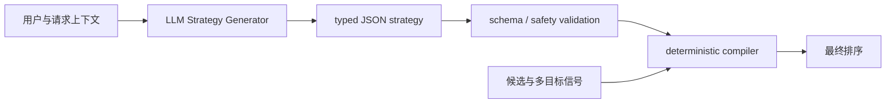
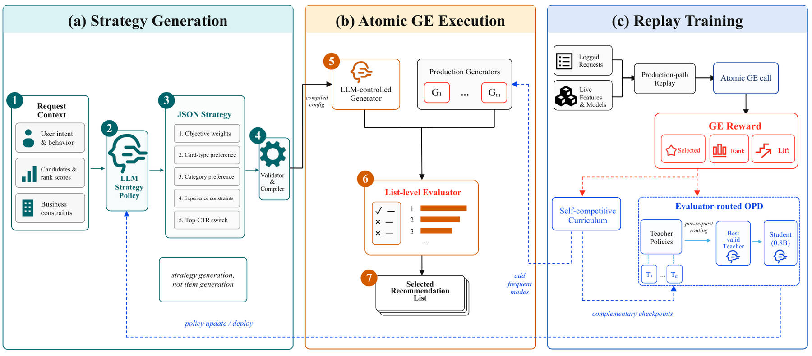

# MetaStrategy：生成可执行排序策略的工业推荐

> **Fidelity：核心机制复现。** 实际训练上下文条件策略生成器，并以确定性 compiler 执行 typed strategy；本地负结果如实保留。

## 论文信息

| 项目 | 内容 |
|---|---|
| 论文链接 | [arXiv 2608.09440](https://arxiv.org/abs/2608.09440) |
| 公司/机构 | Alibaba / Taobao |
| 首次公开日期 | 2026-08-10（arXiv v1） |
| 原文开源代码 | 否：未发现原作者公开代码（核查日期：2026-08-13） |
| Adapter | `metastrategy` |
| 本地复现代码 | [`src/auto_research/reproductions/metastrategy/`](https://github.com/daiwk/auto-research/tree/main/src/auto_research/reproductions/metastrategy/) |

核心训练实现在 [`latest_20260813_common.py`](https://github.com/daiwk/auto-research/blob/main/src/auto_research/reproductions/latest_20260813_common.py)。

## 原始论文总结

### 背景与主要改动

固定打分网络难以按用户当下意图动态改变目标。MetaStrategy 让 LLM 输出带类型的 JSON 排序策略，包括目标权重、内容/类目偏好、约束与位置规则；确定性 compiler 将策略执行在候选列表上，避免自由文本直接控制线上排序。生产训练还用 replay 环境、自竞争 curriculum、evaluator-routed reward-augmented OPD 将 4B teacher 蒸馏到 0.8B student。



<!-- paper-figure:start -->
### 原论文关键图

[](https://arxiv.org/html/2608.09440v1/metastrategy_overview.png)

> **原论文 Figure 1（关键图）**：展示原论文的整体流程、关键阶段及其数据流向。图片来自[原论文](https://arxiv.org/abs/2608.09440)，版权归原作者所有；点击图片可查看来源。
<!-- paper-figure:end -->

### 核心公式

$$
s(i\mid u)=\sum_m w_m(u)f_m(i,u),\qquad w(u)=\operatorname{softmax}(g_\theta(u)).
$$

其中生成器只产生可审计的策略参数，排序由 compiler 确定性执行。

### 论文离线与线上效果

淘宝首页“猜你喜欢”进行了 7 天用户随机线上 A/B：click PV **+2.11%**、IPV **+3.12%**、交易金额 **+2.83%**、曝光 PV **+1.49%**。

## 本地复现

> **本地对照口径**：基线为同预算单目标排序器，实验组为 typed strategy generator + deterministic compiler；NDCG@10 相对变化 -8.51%。

MovieLens-1M 260 users / 420 items、50 steps、seed 42。单目标基线 NDCG@10 0.02083；typed strategy 为 0.01906（**-8.51%**），但 head share 从 0.06538 降到 0.03731，并执行 2,400 个策略 bundle。短训练下多目标约束牺牲了相关性，不能写成线上提升的复现。

```bash
auto-research reproduce --paper metastrategy --dataset-dir data --seed 42
```

固定指标见 [`metrics/movielens1m-seed42.json`](metrics/movielens1m-seed42.json)。

## 复现边界

未复刻淘宝私有日志、生产 replay、4B→0.8B OPD 与 nearline serving；公开实验只验证“生成 typed bundle → 校验 → 确定性执行”的核心路径。
