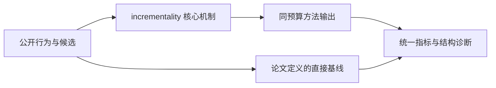
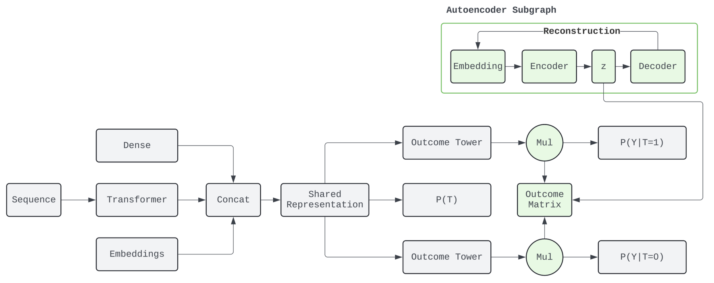

# From Prediction to Incrementality：从预测转向增量价值优化

> **Fidelity: 核心机制复现**。本地代码执行论文最有辨识度、可由公开数据验证的机制；生产模型、私有日志与服务基础设施明确列为边界，不用普通基线冒充完整工业系统。

## 论文信息

| 项目 | 内容 |
| --- | --- |
| 论文链接 | [arXiv 2608.10182](https://arxiv.org/abs/2608.10182) |
| 公司/机构 | LinkedIn（第一作者 Changshuai Wei） |
| 首次公开日期 | 2026-08-10（arXiv v1） |
| 原文开源代码 | 否：论文未提供官方/作者代码（核查日期：2026-09-01） |
| Adapter | `incrementality` |
| 本地复现代码 | [`src/auto_research/reproductions/incrementality/`](https://github.com/daiwk/auto-research/tree/main/src/auto_research/reproductions/incrementality/) |

## 原始论文总结

### 背景与主要改动

分别估计处理与不处理时的潜在结果，以 uplift 及其不确定度代替点击概率排序，再在固定触达预算下完成因果分配。这样优化的是动作带来的增量价值，而不是本来就会发生的结果。



<!-- paper-figure:start -->
### 原论文关键图

[](https://arxiv.org/html/2608.10182v1/figures/model-diagram.png)

> **原论文 Figure 1（关键图）**：展示原论文提出的核心架构、主要模块及其连接关系。图片来自[原论文](https://arxiv.org/abs/2608.10182)，版权归原作者所有；点击图片可查看来源。
<!-- paper-figure:end -->

### 核心公式

$$
\hat\tau(x)=\hat\mu_1(x)-\hat\mu_0(x),\qquad a^*=\arg\max_{a\in\{0,1\}^n}\sum_i a_i\bigl(\hat\tau_i-\lambda\hat\sigma_i\bigr),\;\sum_i a_i\le B.
$$

### 论文离线与线上效果

- LinkedIn 在线 A/B 中主要长期价值 KPI +7.20%，p = 0.041。
- 上述数字只复述论文线上证据，不写入本地公开数据的效果结论。

## 本地复现

> **本地对照口径**：基线按 treated outcome 排序，实验组按 uplift 与不确定度分配；同为 30% 预算，seed 42 的 policy value 为 `0.10408`，基线为 `0.09537`。相对线上长期价值的外推不适用。

三随机种子完整结果、均值、标准差与 95% CI：

- [`metrics/public-seeds42-44.json`](metrics/public-seeds42-44.json)

```bash
auto-research reproduce --paper incrementality --dataset-dir data --seed 42
```

## 复现边界

本地使用公开 MovieLens 特征或由其构造的可审计代理任务，不能复现论文公司的私有用户日志、线上流量分配、生产模型规模和 serving 栈。因此本页只把本地结果解释为机制级验证；不将其外推为论文线上 lift，也不声称与原文绝对指标可直接比较。
