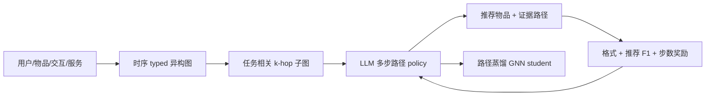
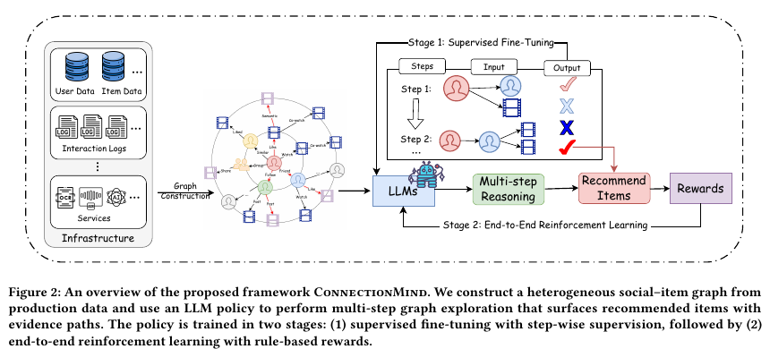

# ConnectionMind：用 LLM 在异构社交图上做可解释多步推荐

> **Fidelity：核心机制复现。** 使用论文同款 Delicious 公开数据，实际执行异构图构建、最短正路径 SFT、规则奖励 GRPO、学生蒸馏和重用户混合推理；本地负结果如实保留。

## 论文信息

| 项目 | 内容 |
| --- | --- |
| 论文链接 | [arXiv 2608.10187](https://arxiv.org/abs/2608.10187) |
| 公司/机构 | Michigan State University / Meta Platforms, Inc. |
| 首次公开日期 | 2026-08-10（arXiv v1） |
| 原文开源代码 | 否：截至 2026-08-20 未发现原作者公开代码 |
| Adapter | `connectionmind` |
| 本地复现代码 | [`src/auto_research/reproductions/connectionmind/`](https://github.com/daiwk/auto-research/tree/main/src/auto_research/reproductions/connectionmind/) |

## 原始论文总结

### 背景与主要改动

传统社交推荐通常把好友关系压成静态 embedding，难以回答“某物品为什么经由哪条社交/兴趣路径被推荐”。ConnectionMind 把用户、物品和语义实体组成带关系类型、时间与权重的异构图；LLM policy 在任务相关子图内逐步扩展 frontier，同时输出推荐物品和对应证据路径。训练先从正反馈目标的最短路径做逐步 SFT，再用格式、最终推荐 F1 和最短路径 shaping 三类规则奖励做端到端 GRPO。生产上只让最复杂的 5%-10% 用户走完整 LLM，其余流量使用从路径教师蒸馏出的 GNN student。



<!-- paper-figure:start -->
### 原论文关键图

[](https://arxiv.org/pdf/2608.10187#page=5)

> 原论文 Figure 2：从生产数据构图，经 SFT 和端到端 RL 训练多步图探索 policy。图片来自[原论文](https://arxiv.org/pdf/2608.10187#page=5)，版权归原作者所有。
<!-- paper-figure:end -->

### 核心公式

逐步监督把状态 $s_d$ 与最短正路径动作 $a_d^*$ 配对：

$$
\mathcal L_{\mathrm{SFT}}=\sum_{(s_d,a_d^*)\in\mathcal D_{\mathrm{SFT}}}-\log p_\theta(a_d^*\mid s_d).
$$

RL rollout 的总奖励为：

$$
R=\alpha_{\mathrm{fmt}}R_{\mathrm{fmt}}+\alpha_{\mathrm{rec}}R_{\mathrm{rec}}+
\frac{\alpha_{\mathrm{step}}}{D_{\max}+1}\sum_d R_{\mathrm{step}},
$$

论文使用 $\alpha_{\mathrm{rec}}=0.5$、$\alpha_{\mathrm{step}}=0.3$、$\alpha_{\mathrm{fmt}}=0.2$，再以组内相对 advantage 更新 policy。

### 论文离线与线上效果

- Delicious：8B ConnectionMind Recall@5/20 为 **0.0631/0.1374**，Precision@5/20 为 **0.0930/0.0841**；Foursquare Recall@10/50 为 **0.0966/0.2084**。
- Meta 私有离线集：Llama-3.1-8B ConnectionMind 相对生产 GNN 的 Recall@10 **+88%**，而 vanilla Llama-3.3-70B 为 **+39%**。
- 数千万用户、多周线上 A/B：曝光 **+0.33% ±0.08%**、观看时长 **+0.43% ±0.14%**、视频 session **+0.22% ±0.13%**。

## 本地复现

> **本地对照口径**：基线为同一 Delicious 图、切分与候选集上的固定异构图聚合；实验组为 SFT+GRPO 路径 policy、蒸馏 student 与 10% 重用户混合推理，相对 NDCG@10 **-7.44%**。

自动下载 HetRec 2011 Delicious-2K；取 180 users、534 items、182 条选中用户间社交边和 64 维 tag 关系，按时间 leave-two-out。SFT 使用 977 条逐步最短路径示范，loss 从 3.9596 降到 3.8091；GRPO 执行 1,440 条 rollout，结构化动作合法率 100%。固定图基线 Recall@10/NDCG@10 为 0.1333/0.0828，实验组为 0.1222/0.0767。小 policy 过度依赖热门路径，说明论文的 3B/8B 语义与路径容量不能由关系标量完全替代。

```bash
auto-research reproduce --paper connectionmind --dataset-dir data --seed 42
```

固定指标见 [`metrics/delicious2k-seed42.json`](metrics/delicious2k-seed42.json)。

## 复现边界

没有复刻 Meta 私有视频图、Llama-3.1 3B/8B、生产级 GNN 和 serving；本地结果只验证完整算法路径，不代表复现论文线上增益。
