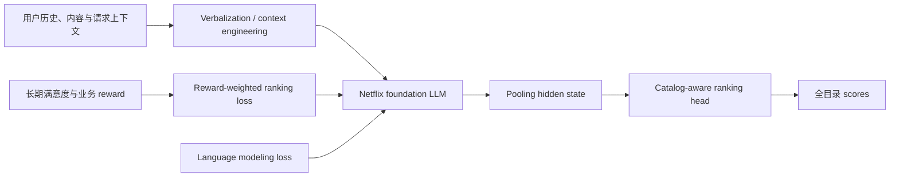

# GenRec：Netflix 的 LLM 推荐精排模型

> **Fidelity：核心机制复现。** 本地真实加载 causal LLM、执行 LoRA Phase-2 后训练、文本化用户历史、全目录 catalog-aware ranking head、联合语言/排序目标和 reward-weighted loss；Netflix 私有 Phase-1 基座与线上 reward model 不可公开，未用固定规则冒充。

## 论文信息

| 项目 | 内容 |
|---|---|
| 论文链接 | [arXiv 2608.10257](https://arxiv.org/abs/2608.10257) |
| 公司/机构 | Netflix |
| 首次公开日期 | 2026-08-10（arXiv v1） |
| 原文开源代码 | 否：截至 2026-08-13 未发现原作者公开代码或模型 checkpoint |
| Adapter | `genrec-netflix` |
| 本地复现代码 | [`src/auto_research/reproductions/genrec_netflix/`](https://github.com/daiwk/auto-research/tree/main/src/auto_research/reproductions/genrec_netflix/) |

## 原始论文总结

### 背景与主要改动

#### 背景

传统 Netflix 排序系统依赖大量人工特征、特征交互和场景专用网络。新增内容形态或推荐场景时，往往要重新设计特征、模型和基础设施。GenRec 把问题从“特征工程”转成“上下文工程”：把用户历史、内容元数据、设备和时间等信号表达成文本，让共享 LLM 主干学习语义与高阶交互。

论文采用两阶段训练：Phase 1 在开源 LLM 上继续训练 Netflix 内容和用户数据，获得内部 foundation LLM；Phase 2 用更新频率更高的推荐排序数据、标签和 reward signals 做任务后训练。论文主要讨论 Phase 2。

#### 主要改动

1. **文本化上下文**：把用户历史、内容元数据和请求上下文转为自然语言或轻结构化文本；通过事件筛选、压缩和描述精简控制 token 成本。
2. **Catalog-aware ranking head**：从 decoder-only LLM 的 pooling 位置取得用户表示，一次前向计算目录内所有物品分数，杜绝目录外幻觉。
3. **联合训练目标**：排序目标与 next-token language objective 联合训练，既学习推荐，又保留文本理解和 prompt steering 能力。
4. **Reward-weighted ranking**：将长期满意度、内容类型平衡和新品阶段等多个 reward model 汇总为样本权重，稳定地对齐业务目标。
5. **Prefill-only serving**：线上不做逐 token 自回归解码，仅执行一次 prefill 后输出全目录分数，降低大候选集排序成本。



<!-- paper-figure:start -->
### 原论文关键图

[](https://arxiv.org/html/2608.10257v1#S4.F1)

> **原论文 Figure 1（关键架构图）**：原始交互日志经上下文工程转成文本，GenRec 在 vLLM 上执行 prefill-only 前向，并为整个目录输出分数。图片来自[原论文](https://arxiv.org/abs/2608.10257)，版权归原作者所有；点击图片可查看来源。
<!-- paper-figure:end -->

### 核心公式

文本化输入为

$$
x=V\!\left(H,\{M_i\}_{i\in C},\tau\right),
$$

LLM 将其编码为 pooled representation $h$，catalog head 用物品向量 $e_i$ 计算 $s_i=\phi(h,e_i)$。整体目标为

$$
\mathcal L=\alpha\mathcal L_{\mathrm{ranking}}+
\beta\mathcal L_{\mathrm{language}}+
\gamma\mathcal L_{\mathrm{misc}},
\qquad \alpha+\beta+\gamma=1.
$$

对样本 $n$ 的多 reward 汇总为权重 $w_n$ 后，排序项写作

$$
\mathcal L_{\mathrm{ranking}}
=-\frac1N\sum_{n=1}^{N}w_n\log
\frac{\exp s_{n,y_n}}{\sum_{i\in C}\exp s_{n,i}}.
$$

### 论文离线与线上效果

- 离线：使用约 **1/40 Phase-2 标注训练样本**和更少输入信号时，MRR 相对成熟生产排序器约 **+1.6%**。
- Phase 1：相对直接使用开源 LLM，离线排序约 **+10%～20%**。
- Phase 2：在 Phase-1 cutoff 时约 **+35%～50%**；两周后因新鲜度收益扩大到约 **80%**。
- 上下文：约从 5,000 token 压缩到 1,700 token，排序质量基本不变，服务成本约降至三分之一。
- 线上：约 **10% Netflix 流量、持续 4 周**；短期首页参与指标 **+0.115%**，$P=3.1\times10^{-10}$；长期核心指标 **+0.006%**，$P=0.025$。

## 本地复现

### 对照口径

> **本地对照口径**：基线是同一 MovieLens 切片、相同 Phase-2 step 和相同训练样本数的 ID-only GRU discriminative ranker；实验组使用更大的公开 causal LLM，因此这是“传统 ID 排序路径 vs LLM-backed 路径”的机制对照，不是同参数量架构消融；NDCG@10 相对 +35.07%（单 seed），不能与 Netflix 的 +1.6% 直接横比。

实验使用 MovieLens-1M 中评分不低于 3 的时间序列，固定 240 users / 500 items、seed 42、120 step。实验组真实加载 `HuggingFaceTB/SmolLM2-135M`，在 q/v projection 注入 LoRA；标题和 genre 组成文本上下文，catalog head 对 500 个物品进行全库排序。Phase-2 每一步联合优化 language completion loss 与 novelty/content-discovery reward-weighted ranking loss。

| 本地方法 | Hit@10 | NDCG@10 | MRR | Head share@10 |
|---|---:|---:|---:|---:|
| ID-only GRU 基线 | 0.02500 | 0.01295 | 0.01873 | 0.08167 |
| GenRec LoRA + catalog head + reward weighting | 0.04167 | 0.01749 | 0.01973 | 0.06250 |
| 相对变化 | **+66.67%** | **+35.07%** | **+5.35%** | **-23.47%** |

这是单 seed、缩小公开数据实验，`formal_comparison=false`；它只表明该设置下核心机制可以训练并得到更好的排序/头部占比联合结果，不构成稳定增益声明。

```bash
pip install -e '.[plum]'
auto-research reproduce \
  --paper genrec-netflix \
  --dataset-dir data \
  --output-dir runs/genrec \
  --device auto \
  --seed 42
```

CPU smoke test 可用环境变量缩小规模：

```bash
AUTO_RESEARCH_GENREC_USERS=40 \
AUTO_RESEARCH_GENREC_ITEMS=150 \
AUTO_RESEARCH_GENREC_STEPS=2 \
auto-research reproduce --paper genrec-netflix --dataset-dir data --device cpu --seed 42
```

固定结果见 [`metrics/movielens1m-smollm2-seed42.json`](metrics/movielens1m-smollm2-seed42.json)。不上传 checkpoint、MovieLens 数据或逐样本预测。

## 复现边界

- Netflix 内部 Phase-1 foundation LLM、数千生产特征和数千亿交互事件不可获得；本地使用公开 SmolLM2 和 MovieLens 文本/反馈。
- 原文 reward 来自长期满意度和业务 reward models；本地只使用可审计的流行度 novelty 与 genre discovery 权重。
- 未复刻 Netflix vLLM 集群、真实延迟、批计算 surface 和线上实验；本地只验证一次 prefill 后的全目录打分语义。
- 原作者未公开代码或 checkpoint，因此无法做逐模块数值一致性验证。
