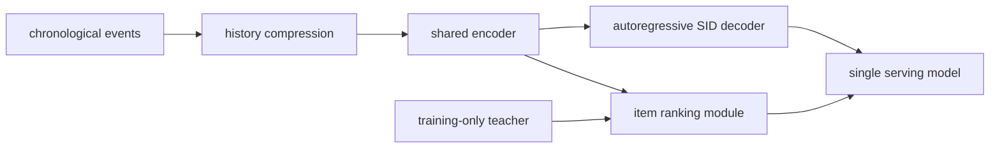
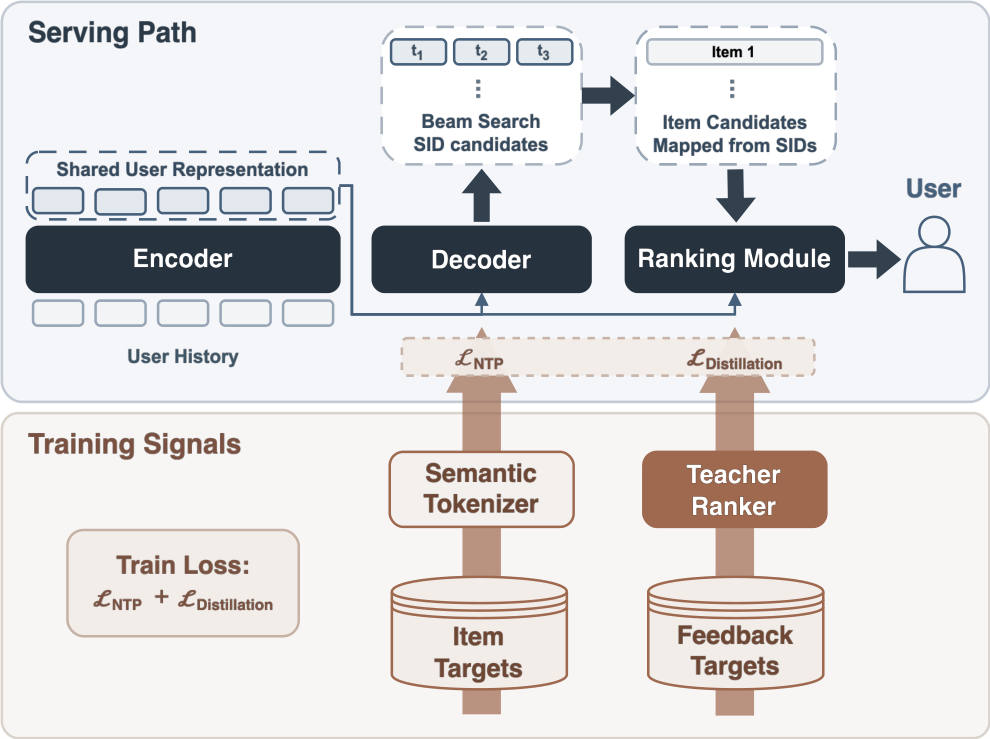

# Sona：单模型替换音乐推荐级联

> **Fidelity：核心机制复现。** 实际训练压缩历史编码器、三层自回归 Semantic ID 头与 item ranker；本地负迁移如实保留。

## 论文信息

| 项目 | 内容 |
|---|---|
| 论文链接 | [arXiv 2608.11015](https://arxiv.org/abs/2608.11015) |
| 公司/机构 | Yandex |
| 首次公开日期 | 2026-08-11（arXiv v1） |
| 原文开源代码 | 否：未发现原作者公开代码（核查日期：2026-08-13） |
| Adapter | `sona` |
| 本地复现代码 | [`src/auto_research/reproductions/sona/`](https://github.com/daiwk/auto-research/tree/main/src/auto_research/reproductions/sona/) |

核心训练实现在 [`latest_20260813_common.py`](https://github.com/daiwk/auto-research/blob/main/src/auto_research/reproductions/latest_20260813_common.py)。

## 原始论文总结

### 背景与主要改动

Yandex Music 原链路有 15 个以上候选生成器与独立预排、精排。Sona 用 chronology event encoder 表示用户，以历史压缩控制长序列成本，自回归生成 Semantic ID，并用同一状态的 Ranking Module 对物品排序；高容量 teacher 只在训练期提供蒸馏监督。



<!-- paper-figure:start -->
### 原论文关键图

[](https://arxiv.org/html/2608.11015v2/Sona_Architecture.png)

> **原论文 Figure 2（关键图）**：展示原论文提出的核心架构、主要模块及其连接关系。图片来自[原论文](https://arxiv.org/abs/2608.11015)，版权归原作者所有；点击图片可查看来源。
<!-- paper-figure:end -->

### 核心公式

$$
\mathcal L=\sum_{k=1}^{K}-\log p_\theta(c_k\mid c_{<k},h_u)+\lambda\,\mathcal L_{\mathrm{rank}}+\mu\,\mathcal L_{\mathrm{distill}}.
$$

### 论文离线与线上效果

My Vibe 智能音箱真实流量 A/B 中，Active Users **+4.53%**、Total Listening Time **+6.30%**、Likes **+11.42%**，论文报告均达到统计显著；一个模型替代原候选生成与排序级联。

## 本地复现

> **本地对照口径**：基线为同预算共享 encoder 排序器，实验组为 history compression + SID decoder + item ranker；NDCG@10 相对变化 -92.05%。

MovieLens-1M 260 users / 420 items、50 steps、seed 42。共享 encoder 基线 NDCG@10 0.02083；压缩 SID + ranker 为 0.00166（**-92.05%**），执行 7,200 个 SID token 目标、历史压缩比 4×。随机 ID 分解和短训练无法获得论文私有语义 tokenizer 的邻域结构，是明确的负结果。

```bash
auto-research reproduce --paper sona --dataset-dir data --seed 42
```

固定指标见 [`metrics/movielens1m-seed42.json`](metrics/movielens1m-seed42.json)。

## 复现边界

未复刻私有音乐语义 tokenizer、完整 teacher、15+ 生产候选源和智能音箱 serving；本地仅验证核心训练与推理数据流。
