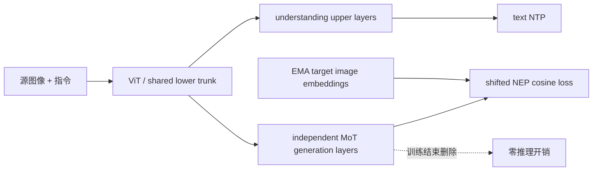
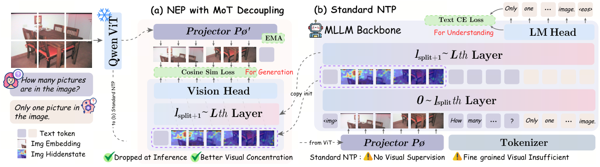

# GAS：以可删除生成分支增强多模态理解

> **Fidelity：核心机制复现。** 本地真实训练共享视觉 trunk、独立 MoT 生成上层、连续 Next Embedding Prediction（NEP）与 EMA target；未复刻 2B/4B Qwen3-VL、10M 生成数据和 32-GPU 两阶段训练。

## 论文信息

| 项目 | 内容 |
|---|---|
| 论文链接 | [arXiv 2608.12209](https://arxiv.org/abs/2608.12209) |
| 公司/机构 | ByteDance |
| 首次公开日期 | 2026-08-12（arXiv v1） |
| 原文开源代码 | 否：未发现原作者公开代码（核查日期：2026-08-13） |
| Adapter | `gas` |
| 本地复现代码 | [`src/auto_research/reproductions/gas/`](https://github.com/daiwk/auto-research/tree/main/src/auto_research/reproductions/gas/) |

核心训练实现在 [`src/auto_research/multimodal/papers.py`](https://github.com/daiwk/auto-research/blob/main/src/auto_research/multimodal/papers.py)。

## 原始论文总结

### 背景与主要改动

常规 MLLM 只用文本 next-token loss，视觉结构只能被语言间接监督；统一理解/生成模型又会把生成参数和开销留到部署阶段。GAS 把生成改成纯训练期辅助任务：理解分支与生成分支共享较低层视觉路径，上层 Transformer 参数解耦；生成分支在与 LLM 输入相同的连续视觉空间自回归预测目标图像 embedding。这样生成梯度能改善共享视觉表征，又不会直接改写理解上层，部署时可整条删除。



### 核心公式

$$
z_i^{\mathrm{tgt}}=P_{\mathrm{EMA}}(\operatorname{ViT}(I_{\mathrm{tgt}}))_i,
\qquad
\hat z_i=f_{\mathrm{gen}}(x_{\mathrm{ctx}},\hat z_{<i}),
$$

$$
\mathcal L=\mathcal L_{\mathrm{NTP}}+\lambda\mathcal L_{\mathrm{NEP}},
\qquad
\mathcal L_{\mathrm{NEP}}=\frac1N\sum_i\left(1-
\frac{\hat z_i^\top z_i^{\mathrm{tgt}}}{\|\hat z_i\|_2\|z_i^{\mathrm{tgt}}\|_2}\right).
$$

### 论文离线与线上效果

同骨干 from-scratch 对照中 Overall 从 **47.25 提升到 48.25（+1.00 pp）**；Perception 从 56.55 到 58.52。2B 主表中 DynaMath **46.2→47.9**、MathVista **54.4→56.4**、CountBenchQA **87.7→90.1**。生成侧训练 GPU-hours 增加 11.6%，但生成分支、vision head 和 EMA projector 全部在部署前删除，因此推理参数与延迟开销为零。论文没有工业线上 A/B。

<!-- paper-figure:start -->
### 原论文关键图

[](https://arxiv.org/html/2608.12209v1/overview_cropped.png)

> **原论文 Figure 1（关键图）**：展示原论文提出的核心架构、主要模块及其连接关系。图片来自[原论文](https://arxiv.org/abs/2608.12209)，版权归原作者所有；点击图片可查看来源。
<!-- paper-figure:end -->

## 本地复现

> **本地对照口径**：基线为同部署结构的 understanding-only 模型，实验组只在训练期增加 MoT + NEP；accuracy 相对提高 3.93%，部署参数开销 0%。

Fashion-MNIST 真实像素，2,000 train / 1,000 test、120 matched steps、seed 42。理解-only baseline accuracy 为 **61.1%**，GAS 为 **63.5%（+2.4 pp）**；visual dependency delta 从 0.509 到 0.529。训练期生成分支含 84,096 参数并把末段 cosine loss 训练到 0.2359，部署模型两组均为 105,226 参数，开销 **0%**。

```bash
auto-research reproduce --paper gas --dataset-dir data --seed 42
auto-research evolve --model micro-vlm --dataset fashion-mnist-qa \
  --direction "比较 GAS 的 MoT 解耦和 next-embedding 辅助监督" \
  --generations 2 --population 4 --steps 120
```

固定指标见 [`metrics/fashion-mnist-qa-seed42.json`](metrics/fashion-mnist-qa-seed42.json)。

## 复现边界

本地用水平镜像后的同类目标图像构造高度相关的生成任务，并在连续 patch embedding 空间执行 shifted cosine NEP；保留 EMA、渐增 $\lambda$、分支隔离与推理删除机制。结果只说明小规模公开数据上的机制可执行，不能与论文 10M 生成样本和 2B/4B benchmark 数字直接比较。
