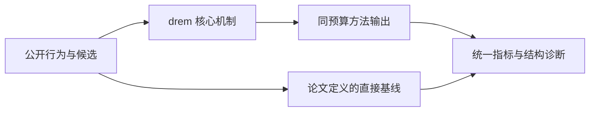
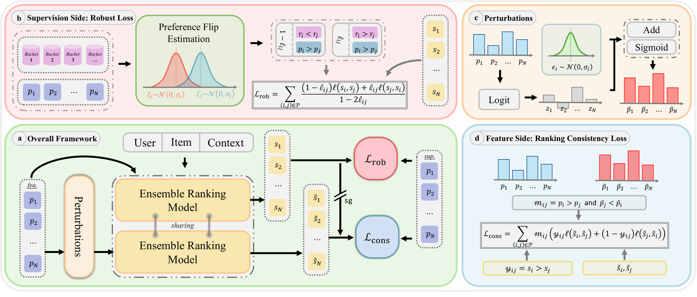

# DrEM：噪声偏好预测下的双侧稳健集成排序

> **Fidelity: 核心机制复现**。本地代码执行论文最有辨识度、可由公开数据验证的机制；生产模型、私有日志与服务基础设施明确列为边界，不用普通基线冒充完整工业系统。

## 论文信息

| 项目 | 内容 |
| --- | --- |
| 论文链接 | [arXiv 2608.12778](https://arxiv.org/abs/2608.12778) |
| 公司/机构 | 深圳大学（第一作者 Canwei Huang） |
| 首次公开日期 | 2026-08-13（arXiv v1） |
| 原文开源代码 | 否：论文未提供官方/作者代码（核查日期：2026-09-01） |
| Adapter | `drem` |
| 本地复现代码 | [`src/auto_research/reproductions/drem/`](https://github.com/daiwk/auto-research/tree/main/src/auto_research/reproductions/drem/) |

## 原始论文总结

### 背景与主要改动

把多路 pxtr 先变换到 logit 空间，对预测噪声做偏好保持筛选，并利用 pair-label 翻转风险反演修正训练目标；最后用一致性融合减小输入扰动导致的排序漂移。



<!-- paper-figure:start -->
### 原论文关键图

[](https://arxiv.org/html/2608.12778v1/main-v2.png)

> **原论文 Figure 1（关键图）**：展示原论文提出的核心架构、主要模块及其连接关系。图片来自[原论文](https://arxiv.org/abs/2608.12778)，版权归原作者所有；点击图片可查看来源。
<!-- paper-figure:end -->

### 核心公式

$$
\tilde z_c=z_c+\epsilon_c,\qquad \hat y_{ij}=\mathbf 1[s_i>s_j],\qquad \ell_{rob}=\frac{\ell(\hat y)-\rho\ell(1-\hat y)}{1-2\rho}.
$$

### 论文离线与线上效果

- 7 天、每组 5.1% 主流量；EMER 的评论率 +1.388%、关注率 +1.197%、播放量 +0.691%，文中报告 p < 0.005。
- 上述数字只复述论文线上证据，不写入本地公开数据的效果结论。

## 本地复现

> **本地对照口径**：基线为朴素三路加权融合，实验组加入偏好保持筛选与风险修正；seed 42 的 NDCG@10 为 `0.07726`，基线为 `0.07518`。代理数据上的相对变化不能替代生产 pxtr lift，跨论文外推不适用。

三随机种子完整结果、均值、标准差与 95% CI：

- [`metrics/public-seeds42-44.json`](metrics/public-seeds42-44.json)

```bash
auto-research reproduce --paper drem --dataset-dir data --seed 42
```

## 复现边界

本地使用公开 MovieLens 特征或由其构造的可审计代理任务，不能复现论文公司的私有用户日志、线上流量分配、生产模型规模和 serving 栈。因此本页只把本地结果解释为机制级验证；不将其外推为论文线上 lift，也不声称与原文绝对指标可直接比较。
