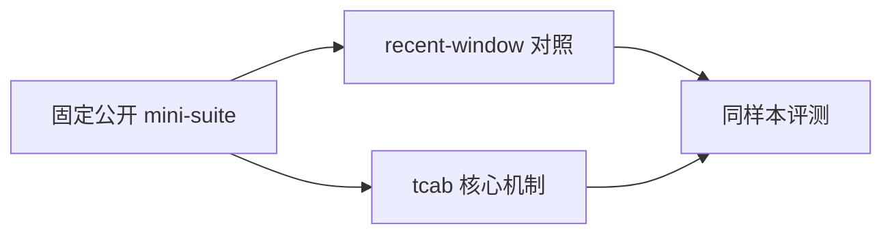
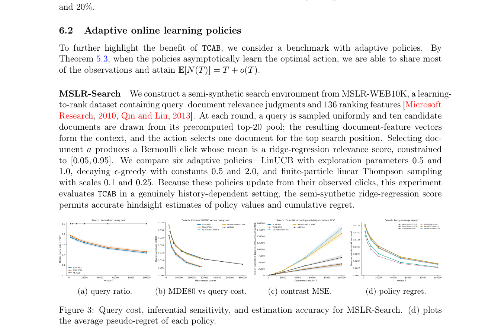

# Fast A/B/n Testing: Exact Multi-Policy Comparison via Tree-Coupled Feedback Sharing

> **复现级别：核心机制 mini-suite。** 本地只验证论文可独立实现的算法路径，不把小规模 NumPy 实验冒充原论文规模训练或线上结果。

## 论文信息

| 字段 | 内容 |
|---|---|
| 论文链接 | [arXiv 2608.12831](https://arxiv.org/abs/2608.12831) |
| 公司/机构 | New York University |
| 第一作者 | Yuxiao Wen |
| 首次公开日期 | 2026-08-13（arXiv v1） |
| 原文开源代码 | 否：截至 2026-08-24 未发现原作者公开代码 |
| Adapter | `tcab` |
| 本地复现代码 | [`src/auto_research/reproductions/tcab/`](https://github.com/daiwk/auto-research/tree/main/src/auto_research/reproductions/tcab/) |

## 原始论文总结

### 背景与主要改动

用最大耦合和最小生成树共享相同决策的反馈，同时保持每个自适应策略的边际轨迹分布不变。



<!-- paper-figure:start -->
### 原论文关键图

[](https://arxiv.org/pdf/2608.12831#page=15)

> **原论文 Figure 3（关键图）**：展示原论文方法的总体设计和关键组成。图片来自[原论文](https://arxiv.org/abs/2608.12831)，版权归原作者所有；点击图片可查看来源。
<!-- paper-figure:end -->

### 核心公式

$$
N(T)=T+\sum_{t,e}D_{e,t}
$$

### 论文离线与线上效果

理论上从独立 A/B/n 的 JT 次反馈降至 T+o(T)，实验改善 cost–precision frontier。 这是原文口径；若原文没有工业 A/B，本页不会把本地结果写成线上收益。

## 本地复现

> **本地对照口径**：基线为同样本 `independent A/B/n feedback`，实验组为 `tcab`；单 seed 变化为 `+0.00%` 个百分点。

同一 seed、同一 64 条样本上，`independent A/B/n feedback` baseline accuracy 为 `1.0000`，`tcab` 为 `1.0000`，绝对变化 `+0.00` 个百分点。单篇原始指标见 [`metrics/public-seed42.json`](metrics/public-seed42.json)，批次索引见 [`../../experiments/historical-b07-b11-seed42.json`](../../experiments/historical-b07-b11-seed42.json)。

```bash
auto-research reproduce --paper tcab --seed 42
```

## 复现边界

本地使用固定长上下文/多模态/评测 mini-suite，未训练论文规模 checkpoint、未实现定制 CUDA kernel，也未复刻论文完整公开 benchmark。该实现用于确认核心数据流、公式和相对计算路径可执行。
