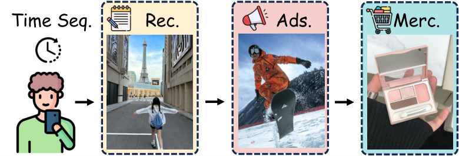

# OneModel：平台级多场景统一排序模型

> **Fidelity: 核心机制复现**。本地真实执行多场景统计、场景投影、SAIM 式门控和全局/局部分层表征；生产 Transformer 与私有特征未复刻。

## 论文信息

| 项目 | 内容 |
| --- | --- |
| 论文链接 | [arXiv 2608.18606](https://arxiv.org/abs/2608.18606) |
| 公司/机构 | Xiaohongshu |
| 首次公开日期 | 2026-08-19（arXiv v1） |
| 原文开源代码 | 否：未发现原作者公开代码（核查日期：2026-08-24） |
| Adapter | `onemodel` |
| 本地复现代码 | [`src/auto_research/reproductions/onemodel/`](https://github.com/daiwk/auto-research/tree/main/src/auto_research/reproductions/onemodel/) |

## 原始论文总结

### 背景与主要改动

推荐、广告和商家推荐通常各训一套排序模型，既重复消耗资源，也无法充分共享跨场景行为。OneModel 将异构特征先投影到统一 event token，再以共享 causal decoder 建模混合长历史；SAIM 用场景条件 gate 调制 FFN，分层表征同时保留全局 attentive pooling 与最近局部状态，从而兼顾迁移与专门化。


<!-- paper-figure:start -->
### 原论文关键图

[](https://arxiv.org/html/2608.18606v2/story.png)

> **原论文 Figure 1（关键图）**：展示原论文方法的总体设计和关键组成。图片来自[原论文](https://arxiv.org/abs/2608.18606)，版权归原作者所有；点击图片可查看来源。
<!-- paper-figure:end -->

### 核心公式

$$
e_i=\phi(W^{(s)}x_i^{(s)}+b^{(s)}),\qquad
z_j=e_{i_j}+\operatorname{Embed}(s_j,a_j,\Delta t_j,pos_j).
$$

SAIM 对场景嵌入生成门控，并调制共享 FFN：

$$
g_t=\sigma(W_g e_s+b_g),\qquad
\operatorname{SAIM}(h_t)=\operatorname{SiLU}(W_1h_t)\odot g_t.
$$

### 论文离线与线上效果

论文在小红书线上报告：Explore Feed 时长 `+0.33%`、互动 `+1.25%`；Feed Ads 广告价值 `+3.43%`、CTR `+8.18%`；Merchant Recommendation DGMV `+1.1867%`、GPM `+2.1585%`。这是进入本仓库工业队列的硬证据。

## 本地复现

> **本地对照口径**：基线为共享全局转移排序器；实验组加入由 MovieLens genre 派生的三个场景、场景转移、sigmoid 门控和 global/local 融合。实验组 NDCG@10 `0.0870`，相对基线 `0.1285` **下降 32.29%**，不是提升。

本地负结果说明，在单一 MovieLens 域上人为切分场景会损失数据密度，不能外推论文的真实跨业务收益。稳定指标见 [`metrics/movielens-1m-seed42.json`](metrics/movielens-1m-seed42.json)。

```bash
auto-research reproduce --paper onemodel --dataset-dir data --seed 42
```

## 复现边界

使用本地 MovieLens-1M 公开数据；没有小红书私有多流日志、action token、统一 Transformer decoder、训练早期梯度隔离、选择性反向传播和在线 serving。核心场景门控路径已执行，但本地指标只验证机制与失败边界。
