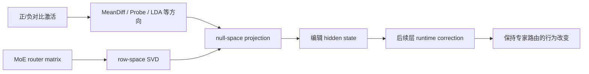
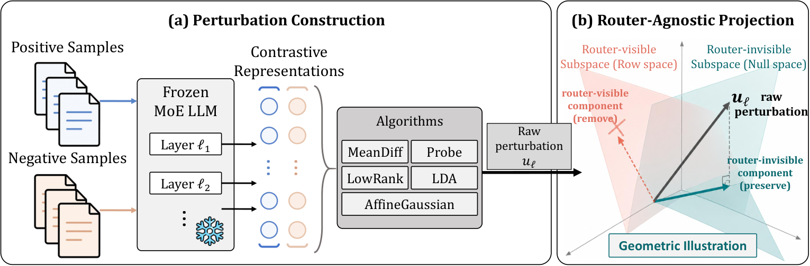

# RARE：不改变专家路由的 MoE 表征编辑

> **Fidelity: 核心机制复现**。真实执行 router 行空间 SVD、零空间投影、路由一致性和下游校正；未加载论文六个大 MoE checkpoint。

## 论文信息

| 项目 | 内容 |
| --- | --- |
| 论文链接 | [arXiv 2608.21236](https://arxiv.org/abs/2608.21236) |
| 公司/机构 | Huazhong University of Science and Technology |
| 首次公开日期 | 2026-08-21（arXiv v1） |
| 原文开源代码 | 否：论文未提供官方/作者代码（核查日期：2026-08-24） |
| Adapter | `rare` |
| 本地复现代码 | [`src/auto_research/reproductions/rare/`](https://github.com/daiwk/auto-research/tree/main/src/auto_research/reproductions/rare/) |

## 原始论文总结

### 背景与主要改动

Dense LLM 的 activation steering 直接用于 MoE 时会改变 router logits，token 被送往不同专家后，原估计的行为方向失效。RARE 将任意 steering direction 投影到 router 的零空间，并在后续保护层再次移除传播产生的 router-visible 分量，在保留原专家路径的同时改变行为表征。



<!-- paper-figure:start -->
### 原论文关键图

[](https://arxiv.org/html/2608.21236v1/methodology.png)

> **原论文 Figure 3（关键图）**：展示原论文提出的核心架构、主要模块及其连接关系。图片来自[原论文](https://arxiv.org/abs/2608.21236)，版权归原作者所有；点击图片可查看来源。
<!-- paper-figure:end -->

### 核心公式

令 $Q_l$ 为 router $R_l$ 行空间的正交基：

$$
\Pi_l^\perp=I-Q_lQ_l^\top,\qquad
h'_l=h_l+\Pi_l^\perp u_l,\quad R_l(h'_l-h_l)=0.
$$

后续保护层用 clean activation 校正传播漂移：

$$
\widetilde h_l=h_l^0+\Pi_l^\perp(h'_l-h_l^0),\qquad
R_l\widetilde h_l=R_lh_l^0.
$$

### 论文离线与线上效果

六个开源 MoE 上，harmfulness steering 平均 ASR `53.3%`，同时保留 MMLU `67.8%`；TruthfulQA MC1 从 `41.0%` 到 `58.6%`，CounterFact efficacy 从 `16.8%` 到 `96.3%`。基础模型论文无工业线上 A/B 要求。

## 本地复现

> **本地对照口径**：基线是未经投影的同一 steering direction；实验组只增加 RARE 零空间投影和解析 correction。实验组 route agreement 从 `0.8237` 到 `1.0000`（相对 **+21.40%**），steering gain 同为 `1.75`。

2048 个状态、64 维、8 experts 的确定性 mini-suite 指标见 [`metrics/routing-mini-suite-seed42.json`](metrics/routing-mini-suite-seed42.json)。

```bash
auto-research reproduce --paper rare --dataset-dir data --seed 42
```

## 复现边界

未加载 DeepSeek-V2-Lite、Mixtral、Phi、Qwen3 或 GPT-OSS，也未运行 JailbreakBench、TruthfulQA、CounterFact。这里验证的是论文式 (8) 的精确路由不变性，不把合成 steering 指标冒充论文下游效果。
