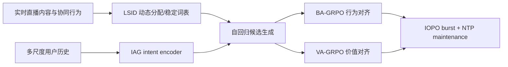
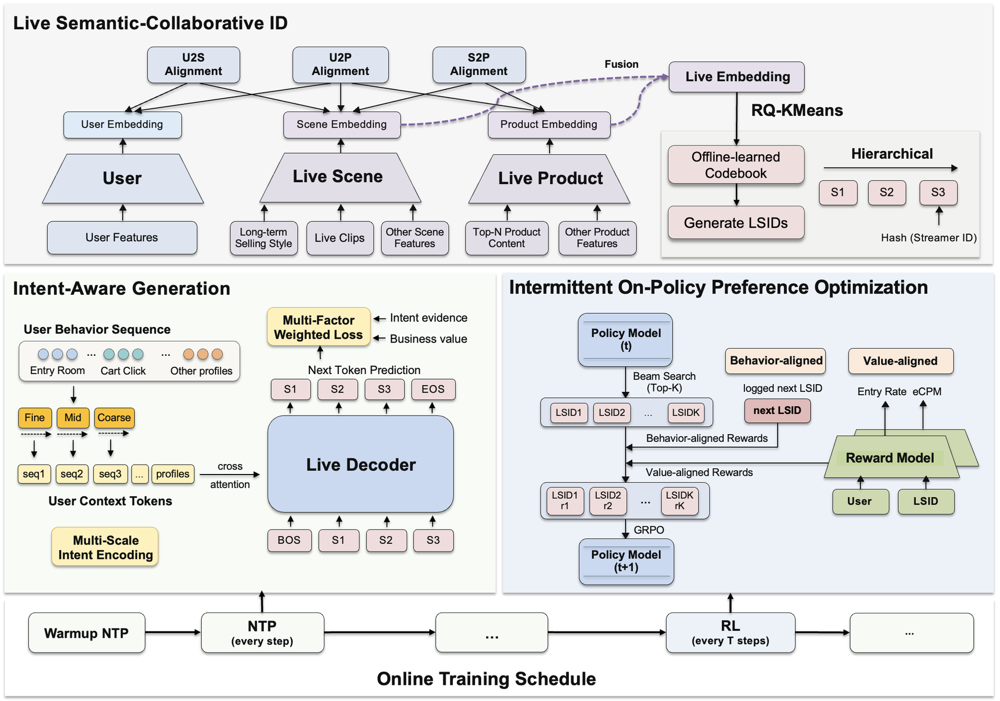

# TAGR：面向直播广告的时序自适应生成式推荐

> **Fidelity：核心机制复现。** 本地执行稳定词表的可刷新 LSID、多尺度 intent 与行为/价值双分支；生产在线训练与广告系统未复刻。

## 论文信息

| 项目 | 内容 |
|---|---|
| 论文链接 | [arXiv 2608.24034](https://arxiv.org/abs/2608.24034) |
| 公司/机构 | 快手科技（第一作者第一署名单位） |
| 首次公开日期 | 2026-08-25（arXiv v1） |
| 原文开源代码 | 否：未发现原作者公开代码（核查日期：2026-08-26） |
| Adapter | `tagr` |
| 本地复现代码 | [`src/auto_research/reproductions/tagr/`](https://github.com/daiwk/auto-research/tree/main/src/auto_research/reproductions/tagr/) |

## 原始论文总结

### 背景与主要改动

直播间内容、商品和反馈高速变化，静态 semantic ID、单一时间尺度历史和离策略偏好优化都会过时。TAGR 在三层适配：LSID 周期刷新语义/协同分配但保持 token 词表稳定；IAG 融合短、中、长期意图；IOPO 间歇执行 on-policy GRPO，并在两次 burst 之间继续 NTP 维护，防止在线 RL 覆盖行为分布。



<!-- paper-figure:start -->
### 原论文关键图

[](https://arxiv.org/html/2608.24034v1/images/fig2-v6.png)

> **原论文 Figure 2（关键图）**：展示原论文方法的总体设计和关键组成。图片来自[原论文](https://arxiv.org/abs/2608.24034)，版权归原作者所有；点击图片可查看来源。
<!-- paper-figure:end -->

### 核心公式

$$
z_u=\operatorname{Fuse}(h_u^{short},h_u^{medium},h_u^{long}),\qquad
p_\theta(c\mid u)=\prod_t p_\theta(c_t\mid c_{<t},z_u).
$$

$$
\mathcal L_{IOPO}=\mathcal L_{NTP}+\lambda_b\mathcal L_{BA-GRPO}+\lambda_v\mathcal L_{VA-GRPO}.
$$

### 论文离线与线上效果

系统服务超过 4 亿 DAU。相对生产 DLRM，线上直播间进入率 **+8.5%**、购物车点击率 **+7.4%**、收入 **+16.1%**；这是本论文进入工业实现队列的硬证据。

## 本地复现

> **本地对照口径**：基线为一阶转移与热度融合；实验组加入两级 LSID、三尺度 intent 和有界行为/价值门控。MovieLens-1M 上 NDCG@10 从 **0.1123 降至 0.0821（-26.86%）**，但 head share 从 **0.7275 降至 0.1303**。

这个负结果说明：在稳定电影域中强行强调“新鲜/长尾”会牺牲精度，不能外推直播广告的时变收益。指标见 [`metrics/movielens-1m-seed42.json`](metrics/movielens-1m-seed42.json)。

```bash
auto-research reproduce --paper tagr --dataset-dir data --seed 42
```

## 复现边界

未使用快手私有日志、在线 reward model、真实 GRPO burst、广告价值标签和实时 serving；本地只验证三个核心适配结构及其在非时变公开数据上的失败边界。
