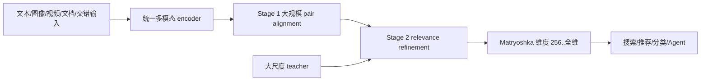
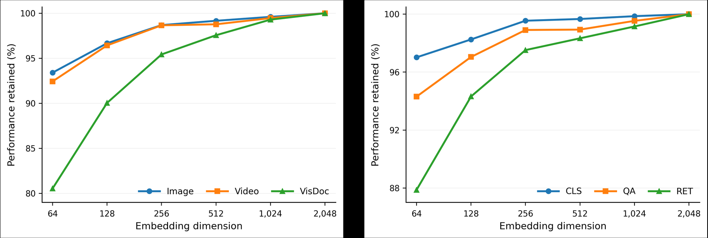

# WeMM-Embedding：微信统一多模态向量模型

> **Fidelity：核心机制复现。** 本地执行两阶段跨模态对齐、cross-scale teacher refinement 与 Matryoshka 截断评测；未冒充 2B/4B/9B checkpoint 训练。

## 论文信息

| 项目 | 内容 |
|---|---|
| 论文链接 | [arXiv 2608.24053](https://arxiv.org/abs/2608.24053) |
| 公司/机构 | WeChat Vision，Tencent（第一作者单位） |
| 首次公开日期 | 2026-08-25（arXiv v1） |
| 原文开源代码 | 是：[Tencent/WeMM-Embedding](https://github.com/Tencent/WeMM-Embedding) |
| Adapter | `wemm-embedding` |
| 本地复现代码 | [`src/auto_research/reproductions/wemm_embedding/`](https://github.com/daiwk/auto-research/tree/main/src/auto_research/reproductions/wemm_embedding/) |

## 原始论文总结

### 背景与主要改动

不同检索任务通常维护独立的文本、图像、视频或文档 encoder。WeMM 把任意交错多模态输入映射到同一空间：第一阶段用数亿 pair 做大规模 alignment；第二阶段加入精选 relevance、细粒度监督和跨尺度知识迁移，并用 Matryoshka 表征支持按成本选择输出维度。



<!-- paper-figure:start -->
### 原论文关键图

[](https://arxiv.org/html/2608.24053v1/figs/mrl-performance-trend.png)

> **原论文 Figure 3（关键图）**：展示原论文方法的总体设计和关键组成。图片来自[原论文](https://arxiv.org/abs/2608.24053)，版权归原作者所有；点击图片可查看来源。
<!-- paper-figure:end -->

### 核心公式

$$
\mathcal L_{align}=-\frac{1}{B}\sum_i\log\frac{\exp(s(q_i,d_i)/\tau)}{\sum_j\exp(s(q_i,d_j)/\tau)},
$$

$$
\mathcal L=\mathcal L_{align}+\lambda_{rel}\mathcal L_{rel}+\lambda_{KD}\sum_m D_{KL}(P_T\Vert P_S^{(m)}).
$$

### 论文离线与线上效果

9B 在 MMEB-v2 达到 **80.6**，2B 已超过此前 8B 开源基线。模型在微信 26 个内部任务和 **14 次线上 A/B** 中持续获益，结果已上线视频号、公众号、朋友圈和电商推荐/搜索。

## 本地复现

> **本地对照口径**：基线为第一阶段共享空间；实验组加入 relevance/cross-scale teacher refinement。MovieLens-1M 的公开内容与协同视图上，Recall@10 从 **0.5611** 到 **0.8389（+49.50%）**，MRR 从 **0.2863** 到 **0.5089**。

指标与 4/8/16 维 Matryoshka 结果见 [`metrics/movielens-1m-seed42.json`](metrics/movielens-1m-seed42.json)。

```bash
auto-research reproduce --paper wemm-embedding --dataset-dir data --seed 42
```

## 复现边界

没有加载原始大 checkpoint 或私有多模态 pair；公开 MovieLens 的内容/协同视图只验证共享空间、两阶段 refinement 与截断维度机制，不代表 MMEB-v2 或微信业务结果复刻。
