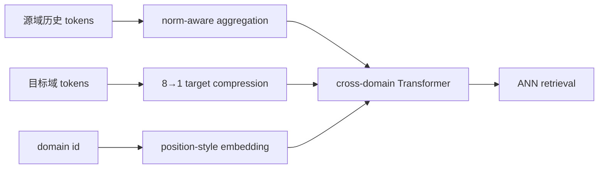
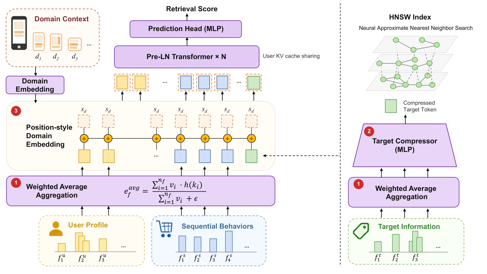

# TransRetrieval：跨域广告召回的压缩 Transformer

> **Fidelity：核心机制复现。** 本地执行 norm-aware 聚合、target-token 压缩和位置化 domain embedding。

## 论文信息

| 项目 | 内容 |
|---|---|
| 论文链接 | [arXiv 2608.25528](https://arxiv.org/abs/2608.25528) |
| 公司/机构 | 中国人民大学 / 阿里巴巴（第一作者第一署名单位为中国人民大学） |
| 首次公开日期 | 2026-08-26（arXiv v1） |
| 原文开源代码 | 否：未发现原作者公开代码（核查日期：2026-08-28） |
| Adapter | `transretrieval` |
| 本地复现代码 | [`src/auto_research/reproductions/transretrieval/`](https://github.com/daiwk/auto-research/tree/main/src/auto_research/reproductions/transretrieval/) |

## 原始论文总结

### 背景与主要改动

跨域广告召回同时受源域噪声、目标域 token 成本和域信息混淆影响。论文按 token norm 聚合源历史，把多个 target tokens 压为一个，并以位置形式注入 domain embedding，减少 target attention 开销。



<!-- paper-figure:start -->
### 原论文关键图

[](https://arxiv.org/html/2608.25528v1/TransRetrieval-model-ready.png)

> **原论文 Figure 1（关键图）**：展示原论文提出的核心架构、主要模块及其连接关系。图片来自[原论文](https://arxiv.org/abs/2608.25528)，版权归原作者所有；点击图片可查看来源。
<!-- paper-figure:end -->

### 核心公式

$$
\bar h_s=\frac{\sum_t\lVert h_t\rVert h_t}{\sum_t\lVert h_t\rVert},\qquad z_t=W_t\bar h_t+e_{domain,pos}.
$$

### 论文离线与线上效果

生产 5% 流量、持续一个月的 A/B：广告收入 **+2.53%**、RPM **+1.28%**（论文报告 $p<0.0001$）。

## 本地复现

> **本地对照口径**：基线为 Transformer two-tower；实验组加入三项核心机制。MovieLens-1M Hit@10 **0.1063 → 0.1187（+11.76%）**，NDCG@10 **0.05429 → 0.05473（+0.81%）**。

指标见 [`metrics/movielens-1m-seed42.json`](metrics/movielens-1m-seed42.json)。

```bash
auto-research reproduce --paper transretrieval --dataset-dir data --seed 42
```

## 复现边界

未使用论文的 400 亿交互、5200 万广告和生产 ANN；85% target FLOPs reduction 是结构诊断，不是端到端延迟实测。
