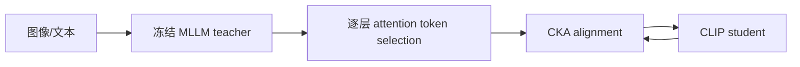
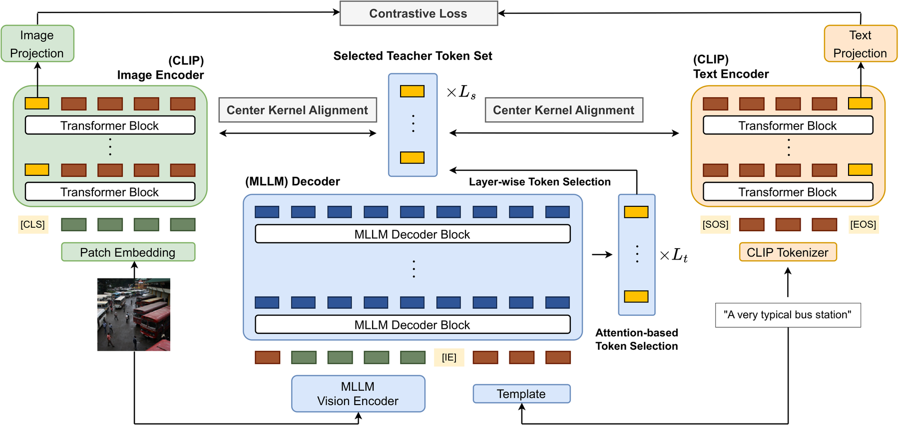

# MLLMCLIP：从多模态大模型蒸馏通用 CLIP

> **Fidelity：核心机制概念验证。** 本地执行逐层 attention token selection 与 CKA feature alignment；不加载原论文 teacher checkpoint。

## 论文信息

| 项目 | 内容 |
|---|---|
| 论文链接 | [arXiv 2608.25575](https://arxiv.org/abs/2608.25575) |
| 公司/机构 | KAIST / Sony Group Corporation（第一作者第一署名单位为 KAIST） |
| 首次公开日期 | 2026-08-26（arXiv v1） |
| 原文开源代码 | 否：未发现原作者公开代码（核查日期：2026-08-28） |
| Adapter | `mllmclip` |
| 本地复现代码 | [`src/auto_research/reproductions/mllmclip/`](https://github.com/daiwk/auto-research/tree/main/src/auto_research/reproductions/mllmclip/) |

## 原始论文总结

### 背景与主要改动

MLLM 的丰富视觉语义难以直接迁移到轻量 CLIP。论文从 teacher 各层按 attention 自适应选 token，以 CKA 对齐 student 图像/文本特征，保留部署时的双塔效率。



<!-- paper-figure:start -->
### 原论文关键图

[](https://arxiv.org/html/2608.25575v1/main3.png)

> **原论文 Figure 2（关键图）**：展示原论文提出的核心架构、主要模块及其连接关系。图片来自[原论文](https://arxiv.org/abs/2608.25575)，版权归原作者所有；点击图片可查看来源。
<!-- paper-figure:end -->

### 核心公式

$$
\operatorname{CKA}(X,Y)=\frac{\lVert Y^TX\rVert_F^2}{\lVert X^TX\rVert_F\lVert Y^TY\rVert_F},\qquad \mathcal L=1-\operatorname{CKA}(X,Y).
$$

### 论文离线与线上效果

论文在 26 个 compositionality、zero-shot classification 与 retrieval benchmark 上报告最佳平均结果；无工业线上 A/B。

## 本地复现

> **本地对照口径**：基线为未蒸馏的公开内容特征；实验组以同一数据的协同视图作 teacher proxy。MovieLens proxy Recall@10 **0.0194 → 0.8306（+4171.43%）**；这个巨大增幅只反映代理视图可预测性，不能外推视觉 benchmark。

指标见 [`metrics/movielens-proxy-seed42.json`](metrics/movielens-proxy-seed42.json)。

```bash
auto-research reproduce --paper mllmclip --dataset-dir data --seed 42
```

## 复现边界

未使用真实图像、MLLM attention 或 26 个论文 benchmark；因此标记为 diagnostic-only，不作为正式视觉效果复现。
