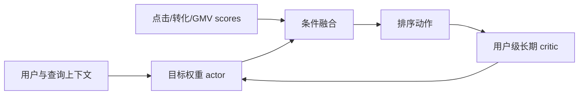
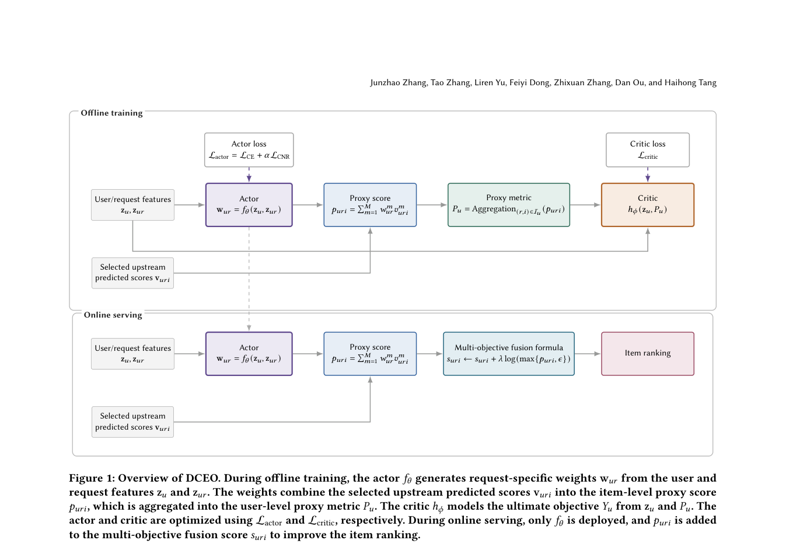

# DCEO：直接优化长期用户价值的因果效果

> **Fidelity：核心机制复现。** 本地执行上下文条件目标权重、用户级 proxy 聚合和相对因果干预；生产 critic 与在线 actor serving 未复刻。

## 论文信息

| 项目 | 内容 |
|---|---|
| 论文链接 | [arXiv 2608.25635](https://arxiv.org/abs/2608.25635) |
| 公司/机构 | 淘宝天猫集团，阿里巴巴（第一作者第一署名单位） |
| 首次公开日期 | 2026-08-26（arXiv v1） |
| 原文开源代码 | 否：未发现原作者公开代码（核查日期：2026-08-28） |
| Adapter | `dceo` |
| 本地复现代码 | [`src/auto_research/reproductions/dceo/`](https://github.com/daiwk/auto-research/tree/main/src/auto_research/reproductions/dceo/) |

## 原始论文总结

### 背景与主要改动

固定加权的点击、转化和 GMV 目标不能随用户状态改变，也无法直接刻画一次排序动作的长期因果价值。DCEO 用 actor 输出上下文相关 simplex 权重，用用户级 critic 估计相对干预效果；线上只保留轻量 actor。



<!-- paper-figure:start -->
### 原论文关键图

[](https://arxiv.org/pdf/2608.25635#page=4)

> **原论文 Figure 1（关键图）**：展示原论文的训练流程与关键优化环节。图片来自[原论文](https://arxiv.org/abs/2608.25635)，版权归原作者所有；点击图片可查看来源。
<!-- paper-figure:end -->

### 核心公式

$$
w(x)=\operatorname{softmax}(g_\theta(x)),\quad s(x,i)=\sum_k w_k(x)s_k(x,i),\quad \Delta V=V(u\mid do(a))-V(u\mid do(a_0)).
$$

### 论文离线与线上效果

淘宝搜索 41 天生产 A/B 中 GMV **+0.36%**；这是进入工业实现队列的量化线上证据。

## 本地复现

本地实现现在把 `causal_gain × temperature` 纳入 evolve 搜索空间：20 个候选只在 validation 上按 `NDCG@10 + 0.15 × Hit@10` 选择，随后仅对冠军运行一次 held-out test。这样不会再用固定 `0.75` 增益换取 Hit 上升、NDCG 下降后仍把它描述为整体提升。

> **本地对照口径**：基线为同一组 proxy score 的固定 log fusion；实验组为上下文条件 actor。MovieLens-1M 上 Hit@10 **0.1469 → 0.1500（+2.13%）**，NDCG@10 **0.07127 → 0.07078（-0.69%）**。

指标见 [`metrics/movielens-1m-seed42.json`](metrics/movielens-1m-seed42.json)。

```bash
auto-research reproduce --paper dceo --dataset-dir data --seed 42
```

## 复现边界

proxy outcome 与真实长期 GMV 不等价；本地负相关诊断明确阻止把 Hit 改善解读为长期价值提升。
