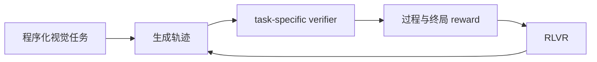
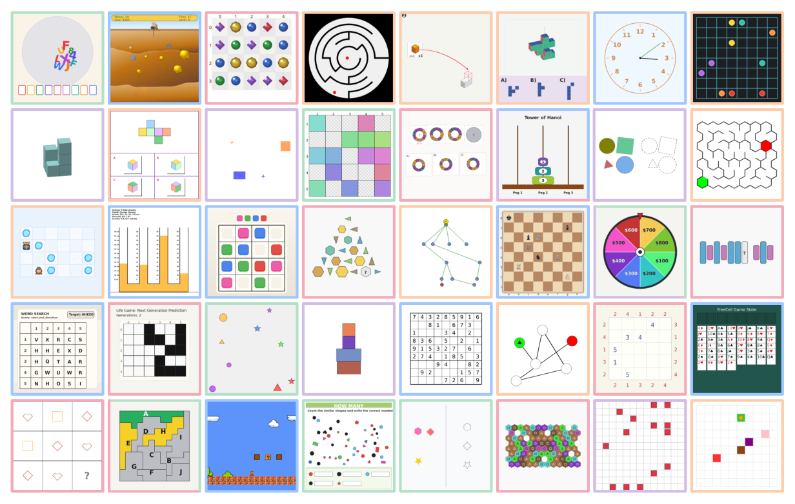

# VBVR-Pro：可执行视觉推理验证器

> **Fidelity：核心机制的程序化验证。** 本地复刻 task-specific deterministic scorer 与标量 judge 对照，不训练视频生成大模型。

## 论文信息

| 项目 | 内容 |
|---|---|
| 论文链接 | [arXiv 2608.26105](https://arxiv.org/abs/2608.26105) |
| 公司/机构 | 南洋理工大学 / VBVR Community（第一作者第一署名单位为南洋理工大学） |
| 首次公开日期 | 2026-08-26（arXiv v1） |
| 原文开源代码 | 是：[项目页与公开资源](https://www.video-reason.com/?v=pro) |
| Adapter | `vbvr-pro` |
| 本地复现代码 | [`src/auto_research/reproductions/vbvr_pro/`](https://github.com/daiwk/auto-research/tree/main/src/auto_research/reproductions/vbvr_pro/) |

## 原始论文总结

### 背景与主要改动

通用 VLM judge 容易被流畅输出误导，难以逐实例核对时空状态。VBVR-Pro 为每种任务定义可执行 scorer，把中间状态、约束和最终状态都变成可验证奖励，并据此训练多模态生成模型。



<!-- paper-figure:start -->
### 原论文关键图

[](https://arxiv.org/html/2608.26105v1/VBVR_pro_data_overview_v3.png)

> **原论文 Figure 2（关键图）**：展示原论文方法的总体设计和关键组成。图片来自[原论文](https://arxiv.org/abs/2608.26105)，版权归原作者所有；点击图片可查看来源。
<!-- paper-figure:end -->

### 核心公式

$$
R(\tau)=\sum_j\lambda_j\mathbf 1[c_j(\tau)=\mathrm{true}],\qquad \max_\theta\mathbb E_{\tau\sim\pi_\theta}[R(\tau)].
$$

### 论文离线与线上效果

scorer 人类逐票一致率超过 **0.60**，高于 GPT-5.5 的 **0.54**；任务训练九个模型平均总体提升 **0.290**，无工业线上 A/B。

## 本地复现

> **本地对照口径**：基线为带噪标量 VLM-judge analogue；实验组为三个确定性 task-specific verifier。300 个程序化任务 reward mean **0.5942 → 1.0000（+68.30%）**。

指标见 [`metrics/procedural-seed42.json`](metrics/procedural-seed42.json)。

```bash
auto-research reproduce --paper vbvr-pro --dataset-dir data --seed 42
```

## 复现边界

该结果只验证 scorer 的确定性和可解释失败归因，不等同于论文七个外部 benchmark 或 14B/19B checkpoint 训练。
