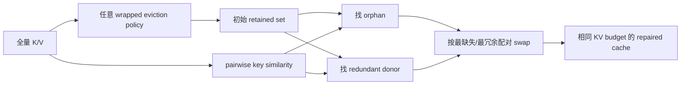
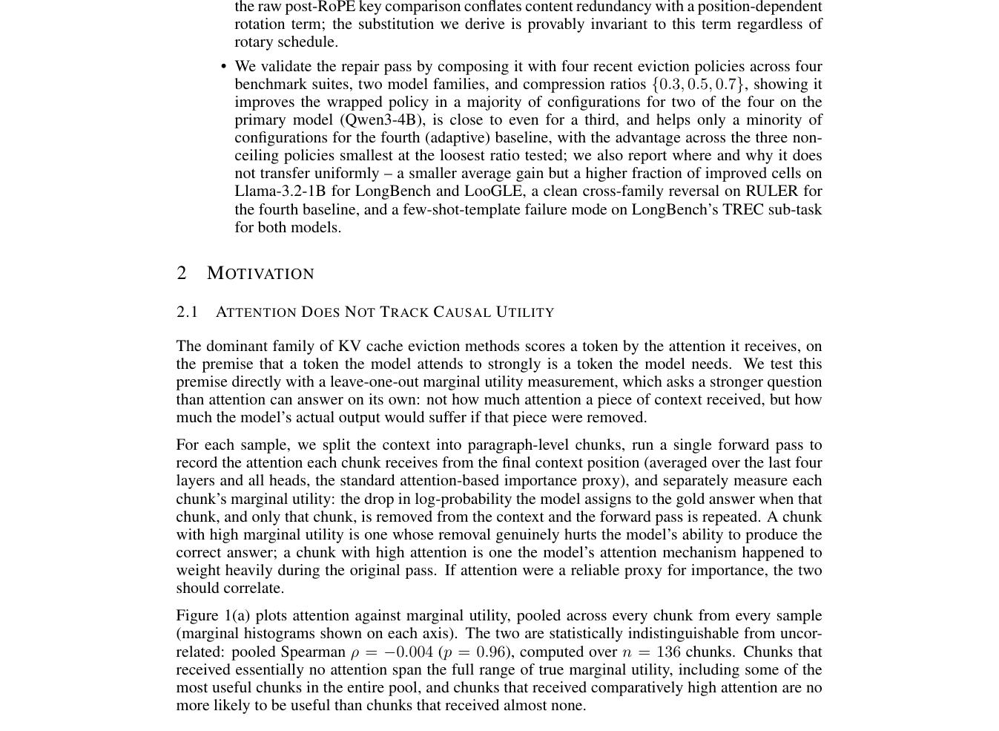

# TwinKV：固定预算的 KV Cache 淘汰修复

> **复现级别：核心机制 + 真实 checkpoint KV 验证。** Equation 4、等预算 swap 与 Qwen3 实际 KV tensor 均执行；没有把 attention reconstruction 指标写成完整 LongBench 分数。

## 论文信息

| 项目 | 内容 |
| --- | --- |
| 论文链接 | [arXiv 2608.27128](https://arxiv.org/abs/2608.27128) |
| 公司/机构 | The Hong Kong University of Science and Technology (Guangzhou) |
| 首次公开日期 | 2026-08-27（arXiv v1） |
| 原文开源代码 | 否：原作者未发布代码（核查日期：2026-08-29） |
| Adapter | `twinkv` |
| 本地复现代码 | [`src/auto_research/reproductions/twinkv/`](https://github.com/daiwk/auto-research/tree/main/src/auto_research/reproductions/twinkv/) |

## 原始论文总结

### 背景与主要改动

现有 KV eviction 常按 token 重要性选择缓存，但可能同时保留多个几乎重复的 key，并删掉没有替代者的 orphan。TwinKV 不替代 StreamingLLM、H2O 等基础策略，而是一个可组合 repair pass：在完全不增加 KV budget 的前提下，找出“被删且没有相似保留项”的 orphan，与“已保留但有高度相似 twin”的 donor 成对交换。



<!-- paper-figure:start -->
### 原论文关键图

[](https://arxiv.org/pdf/2608.27128#page=3)

> **原论文 Figure 1（关键图）**：展示原论文方法的总体设计和关键组成。图片来自[原论文](https://arxiv.org/abs/2608.27128)，版权归原作者所有；点击图片可查看来源。
<!-- paper-figure:end -->

### 核心公式

对 token $i$，只在超出局部窗口的已保留集合 $R$ 中寻找最相似 twin：

$$
s_i=\max_{j\in R,\ |i-j|>w}\cos(k_i,k_j).
$$

被淘汰且 $s_i<\tau$ 的 token 是 orphan；已保留、非 sink/recent 且 $s_i\ge\tau$ 的 token 是 donor。orphan 按 $s_i$ 升序、donor 按 $s_i$ 降序配对，交换数量

$$m=\min(|O|,|D|),\qquad |R'|=|R|.$$

### 论文离线与线上效果

论文在 Qwen3-4B 与 Llama-3.2-1B、LongBench/LooGLE/RULER/MMLU-Pro 上比较 0.3/0.5/0.7 压缩率。TwinKV 整体改善多种 wrapped policy，但原文也明确报告 TREC 等任务的失败情形，因此不能把它描述为所有数据集都单调提升。该工作没有工业线上 A/B。

## 本地复现

> **本地对照口径**：基线是 StreamingLLM sink + recent eviction，实验组是完全相同 KV 数量的 StreamingLLM + TwinKV；正式指标是相对 full-cache attention output 的 cosine、repair 时延、KV bytes 和峰值显存；不适用 DIN。机制测试严格保持 **0.00% budget change**。

```bash
auto-research reproduce --paper twinkv --seed 42

python -m auto_research.reproductions.twinkv.checkpoint \
  --output runs/twinkv-wikitext2.json \
  --revision <pinned-model-revision> \
  --dataset-revision <pinned-dataset-revision> \
  --examples 3 --sequence-length 2048 --compression-ratio 0.5 --seed 42
```

机制指标见 [`metrics/mechanism-seed42.json`](metrics/mechanism-seed42.json)，A100 的真实 checkpoint 指标见 [`../../gpu-validations/twinkv-a100-20260829.json`](../../gpu-validations/twinkv-a100-20260829.json)。checkpoint 不上传 GitHub。

## Evolve 接入

论文映射为可执行 `twinkv` micro-LLM operator。第一代固定模型宽深、token budget 和优化器，只比较 dense causal attention 与 prefix-local TwinKV；后续再搜索压缩率、相似度阈值和 local window。真实 checkpoint runner 用同一套 repair 函数，避免 Evolve 与验证代码分叉。

## 复现边界

正式 GPU smoke 使用 Qwen3 的真实 K/V 和公开 WikiText-2 长上下文，评测三个代表层的 attention reconstruction；它不是完整 LongBench generation。当前实现是精确 $n\times K$ repair，临时矩阵比论文朴素 $n^2$ 实现小，但尚未提供 fused CUDA kernel。
